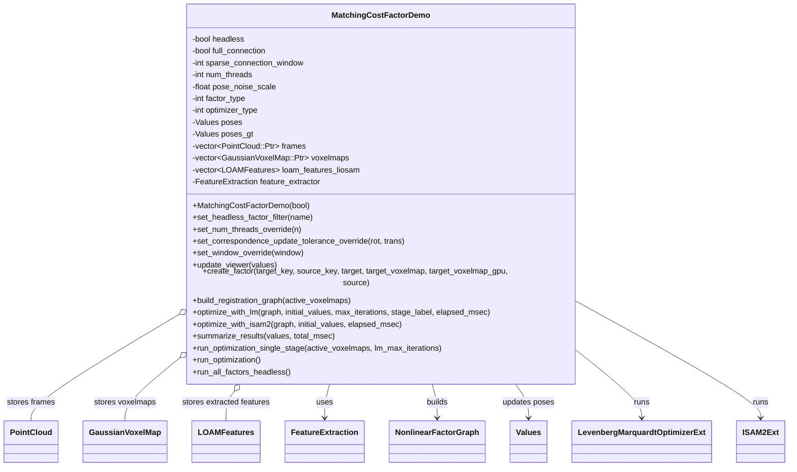
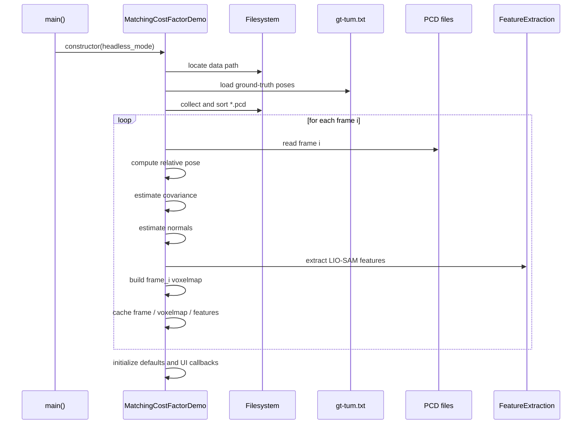
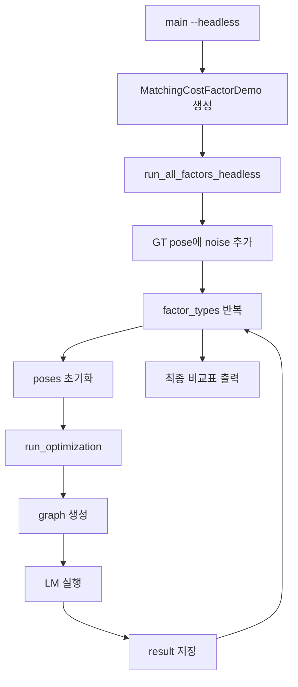

# main 현재 코드 구조 및 UML 정리 (2026-03-12)

## 1) 목적

이 문서는 현재 `src/main.cpp`의 실제 구조를 기준으로 다음 내용을 한 번에 설명한다.

- 프로그램의 진입점과 실행 모드 분기
- `MatchingCostFactorDemo` 클래스가 담당하는 상태와 역할
- 데이터 로딩 -> factor 생성 -> graph 구성 -> 최적화 -> 결과 요약 흐름
- `full_connection` / `sparse_connection_window`가 graph topology에 미치는 영향
- 현재 구현이 `pairwise factor graph benchmark`에 가깝다는 점

핵심 요약:

> 현재 `src/main.cpp`는 "GUI 데모 + headless 벤치마크 + data loading + graph construction + optimization"이 `MatchingCostFactorDemo` 클래스 하나에 집중된 구조다.

---

## 2) 대상 파일 및 큰 그림

- 대상 파일: `src/main.cpp`
- 핵심 클래스: `MatchingCostFactorDemo` (`src/main.cpp:73`)
- 진입점: `main()` (`src/main.cpp:997`)

현재 구조는 크게 5단계로 이해하면 된다.

1. 프로그램 시작 / CLI 파싱
2. 생성자에서 데이터 로딩 + 전처리 + GUI 준비
3. factor 종류와 graph mode 선택
4. factor graph 생성 및 optimizer 실행
5. 결과 요약 또는 GUI 시각화

---

## 3) 한 줄 해석

현재 코드는 **scan-to-map / local submap 기반 SLAM 백엔드**라기보다,

- 여러 프레임을 읽고
- 프레임별 point cloud / voxel map / feature를 준비한 뒤
- 선택한 factor로
- **pose-to-pose registration factor graph**를 구성하고
- GUI 또는 headless benchmark로 결과를 비교하는

**batch registration benchmark demo** 구조에 가깝다.

중요한 해석 포인트:

- `voxelmaps[i]`는 "프레임 i 하나"에서 만든 voxel map이다. (`src/main.cpp:281`)
- `build_registration_graph()`는 frame pair 사이에 factor를 추가한다. (`src/main.cpp:667`)
- 즉 현재 기본 구조는 `source frame j -> target frame i`의 pairwise 정합이다. (`src/main.cpp:570`)
- 최근 여러 프레임을 합친 merged local map / submap target은 현재 없다.

---

## 4) 파일 내부 구조 개요

| 구간 | 라인 | 역할 |
|---|---:|---|
| include / 컴파일 분기 | `src/main.cpp:12` | STL, GTSAM, gtsam_points, GUI, LOAM feature 의존성 포함 |
| 메인 클래스 선언 | `src/main.cpp:73` | 전체 애플리케이션 상태 보관 |
| 생성자 | `src/main.cpp:76` | 로깅, GUI 준비, GT/PCD 로딩, frame/voxelmap 생성, UI 초기화 |
| override setter | `src/main.cpp:458` | headless용 factor/thread/window override |
| 뷰어 갱신 | `src/main.cpp:484` | pose, graph edge, feature 시각화 |
| factor factory | `src/main.cpp:570` | 알고리즘별 factor 생성 분기 |
| graph builder | `src/main.cpp:667` | prior + registration edge 추가 |
| optimizer path | `src/main.cpp:691` | LM / ISAM2 최적화 분기 |
| result summary | `src/main.cpp:783` | 프레임별 오차와 summary 통계 출력 |
| headless benchmark loop | `src/main.cpp:911` | 모든 factor 반복 실행 및 비교표 출력 |
| main 함수 | `src/main.cpp:997` | CLI 파싱 후 GUI/headless 실행 분기 |

---

## 5) 핵심 클래스: `MatchingCostFactorDemo`

현재 파일의 대부분 기능은 `MatchingCostFactorDemo` 안에 들어 있다.

이 클래스는 다음 4가지 성격을 동시에 가진다.

1. **애플리케이션 상태 저장소**
2. **데이터 로더 / 전처리기**
3. **graph builder + optimizer orchestrator**
4. **GUI controller**

즉 역할이 꽤 넓게 묶여 있는 "monolithic demo controller" 구조다.

### 5.1 멤버 상태 분류

| 분류 | 멤버 | 의미 |
|---|---|---|
| 실행 모드 | `headless`, `optimization_thread` | GUI/CLI 실행 방식과 최적화 스레드 |
| 파라미터 | `pose_noise_scale`, `num_threads`, `full_connection`, `sparse_connection_window` | 실험/그래프 제어값 |
| 알고리즘 선택 | `factor_types`, `factor_type`, `optimizer_types`, `optimizer_type` | factor/optimizer 선택 상태 |
| correspondence 제어 | `correspondence_update_tolerance_rot`, `correspondence_update_tolerance_trans` | factor 공통 tolerance |
| pose 상태 | `poses`, `poses_gt` | 현재 추정 pose, GT pose |
| 프레임 데이터 | `frames`, `voxelmaps`, `frames_with_ring` | point cloud와 voxelmap |
| 특징점 | `loam_features_liosam`, `feature_extractor` | LIO-SAM feature 기반 LOAM factor 입력 |
| 결과 캐시 | `last_mean_trans_error`, `last_total_ms`, `last_iteration` 등 | benchmark 출력용 최근 결과 |

관련 선언 위치: `src/main.cpp:869`

---

## 6) 생성자 기반 초기화 구조

현재 구조의 가장 큰 특징은 **생성자에서 거의 모든 준비 작업이 끝난다**는 점이다.

생성자(`src/main.cpp:76`) 안에서 다음 순서로 초기화가 진행된다.

1. 로깅 초기화 (`src/main.cpp:78`)
2. GUI viewer 가능 여부 확인 (`src/main.cpp:84`)
3. data path 탐색 (`src/main.cpp:99`)
4. GT pose 로딩 (`src/main.cpp:117`)
5. CUDA linearization hook 등록 (`src/main.cpp:138`)
6. PCD 목록 수집 및 정렬 (`src/main.cpp:143`)
7. 첫 프레임 기준 원점 pose 계산 (`src/main.cpp:183`)
8. 각 프레임 반복 처리 (`src/main.cpp:193`)
   - PCD 읽기
   - relative pose 계산
   - point cloud 변환
   - covariance 추정
   - normal 추정
   - LOAM feature 추출
   - voxel map 생성
   - GUI drawable 등록
9. 기본 파라미터 / factor list / optimizer list 설정 (`src/main.cpp:361`)
10. ImGui control callback 등록 (`src/main.cpp:392`)

이 구조 덕분에 `main()`은 단순하지만, 반대로 생성자 책임이 매우 크다.

---

## 7) 데이터 준비 파이프라인

### 7.1 입력 데이터

입력은 기본적으로 다음 두 종류다.

- `gt-tum.txt`: timestamp -> GT pose 매핑 (`src/main.cpp:121`)
- `*.pcd`: frame별 point cloud (`src/main.cpp:149`)

각 PCD 파일은 파일명 timestamp를 기준으로 GT pose와 매칭된다. (`src/main.cpp:198`, `src/main.cpp:203`)

### 7.2 프레임별 전처리

프레임 반복 루프는 `src/main.cpp:193`에 있다.

프레임 i에 대해 수행하는 작업은 다음과 같다.

1. point cloud 읽기 (`src/main.cpp:214`)
2. ring 정보 저장 (`src/main.cpp:222`)
3. `float -> homogeneous Vector4d` 변환 (`src/main.cpp:241`)
4. covariance 추정 (`src/main.cpp:249`)
5. `PointCloudCPU/GPU` 생성 및 point/cov 추가 (`src/main.cpp:254`)
6. normal 추정 및 추가 (`src/main.cpp:264`)
7. LIO-SAM feature 추출 (`src/main.cpp:275`)
8. Gaussian voxel map 생성 (`src/main.cpp:281`)

### 7.3 중요한 구조적 해석

현재 `voxelmaps[i]`는

```text
frame_i 하나를 insert한 voxel map
```

이다.

즉 이것은

```text
merged local map / submap
```

이 아니라,

```text
single-frame target voxel map
```

이다.

이 점이 이후 graph mode 해석에서 매우 중요하다.

---

## 8) GUI 모드와 Headless 모드 분기

### 8.1 GUI 모드

GUI 모드는 viewer가 가능할 때 기본 모드다.

- viewer 생성: `src/main.cpp:84`
- UI callback 등록: `src/main.cpp:392`
- 사용자 interaction:
  - noise 추가
  - graph mode 토글
  - sparse window 변경
  - factor 선택
  - optimizer 선택
  - tolerance 조정
  - optimize 실행

즉 GUI 모드는 **인터랙티브 실험/시각화 도구**에 가깝다.

### 8.2 Headless 모드

headless 모드는 `--headless`로 진입한다. (`src/main.cpp:1009`)

실행 흐름:

1. noisy initial pose 생성 (`src/main.cpp:920`)
2. factor 목록 반복 (`src/main.cpp:946`)
3. 각 factor마다 poses 초기화 (`src/main.cpp:963`)
4. `run_optimization()` 실행 (`src/main.cpp:970`)
5. 결과를 Result 배열에 저장 (`src/main.cpp:972`)
6. 최종 비교표 출력 (`src/main.cpp:981`)

즉 headless는 **자동 benchmark runner** 역할이다.

---

## 9) Graph topology 제어 구조

현재 graph topology는 두 값으로 제어된다.

- `full_connection` (`src/main.cpp:385`)
- `sparse_connection_window` (`src/main.cpp:386`)

### 9.1 기본값

기본값은 다음과 같다.

```cpp
full_connection = false;
sparse_connection_window = 4;
```

즉 기본 모드는 **sparse graph**다.

### 9.2 실제 graph builder 분기

실제 edge 추가는 `build_registration_graph()`에서 결정된다. (`src/main.cpp:667`)

핵심 코드는 다음과 같다.

```cpp
int sparse_j_end = i + std::max(2, sparse_connection_window);
int j_end = full_connection ? num_frames : std::min(sparse_j_end, num_frames);
for (int j = i + 1; j < j_end; j++) {
  auto factor = create_factor(i, j, frames[i], active_voxelmaps[i], nullptr, frames[j]);
  graph.add(factor);
}
```

의미:

- `full_connection=true`: 모든 `i<j` pair 연결
- `full_connection=false` + `window=2`: pure chain (`i -> i+1`)
- `full_connection=false` + `window=4`: `i -> i+1, i+2, i+3`까지 local sparse edge 추가

### 9.3 중요한 오해 방지

현재의 `window`는

```text
sliding window local map의 window
```

가 아니다.

현재의 `window`는

```text
pose pair edge를 몇 칸 앞까지 연결할지
```

를 의미한다.

즉 지금 코드는 **graph edge window**를 사용하고 있으며, **merged local submap window**를 사용하지 않는다.

---

## 10) Factor factory 구조

`create_factor()` (`src/main.cpp:570`)는 현재 factor 선택의 중심이다.

입력:

- `target_key`, `source_key`
- `target` point cloud
- `target_voxelmap`
- `source` point cloud

출력:

- `gtsam::NonlinearFactor::shared_ptr`

### 10.1 현재 지원하는 factor

| factor 이름 | target 입력 | source 입력 | 비고 |
|---|---|---|---|
| Point-to-Point | `target frame` | `source frame` | ICP |
| Point-to-Plane | `target frame` | `source frame` | normal 사용 |
| GICP | `target frame` | `source frame` | covariance 사용 |
| VGICP | `target_voxelmap` | `source frame` | frame별 voxel map 사용 |
| NDT | `target_voxelmap` | `source frame` | `DIRECT7` |
| LightNDT | `target_voxelmap` | `source frame` | scoreless 변형 |
| LOAM_LIOSAM | target/source feature sets | feature sets | LIO-SAM feature 기반 |

### 10.2 구조적 의미

이 factory를 보면 현재 구조는 대부분

```text
frame_i / voxelmap_i  <->  frame_j
```

형태다.

즉 factor는 pose-graph 안에 들어가지만, measurement는 기본적으로 **pairwise registration**이다.

---

## 11) 최적화 경로 구조

최적화 경로는 3단계 함수로 분리되어 있다.

1. `run_optimization_single_stage()` (`src/main.cpp:844`)
2. `optimize_with_lm()` (`src/main.cpp:691`) 또는 `optimize_with_isam2()` (`src/main.cpp:739`)
3. `summarize_results()` (`src/main.cpp:783`)

### 11.1 orchestration 함수

`run_optimization_single_stage()`가 하는 일:

1. graph 생성
2. optimizer 선택
3. 실행 시간 측정
4. 결과 summary 출력

즉 실제 실행 orchestration은 이 함수가 담당한다.

### 11.2 LM 경로

`optimize_with_lm()`는

- `LevenbergMarquardtExtParams` 구성
- callback으로 iteration 로그 출력
- headless가 아니면 매 iter viewer 업데이트
- `optimizer.optimize()` 실행
- iteration 수와 time 기록

을 수행한다.

### 11.3 ISAM2 경로

`optimize_with_isam2()`는

- 초기 update 1회
- 추가 update 5회
- estimate 계산

형태로 동작한다.

즉 현재 파일에서 ISAM2는 **interactive incremental 느낌의 비교용 경로**에 가깝고, headless benchmark 기본은 LM이다. (`src/main.cpp:969`)

---

## 12) 결과 요약 구조

`summarize_results()` (`src/main.cpp:783`)는 다음 값을 계산한다.

- 프레임별 optimized pose
- GT 대비 translation / rotation error
- mean / max translation error
- mean / max rotation error
- iterations
- optimization time

headless 모드에서는 이 값들이 factor별 `Result` 배열로 쌓이고, 최종적으로 ASCII table 형태의 비교표로 출력된다. (`src/main.cpp:981`)

---

## 13) `main()` 함수 역할

`main()` (`src/main.cpp:997`)는 생각보다 단순하다.

하는 일은 다음뿐이다.

1. CLI 파싱
   - `--headless`
   - `--factor`
   - `--threads`
   - `--corr-rot`
   - `--corr-trans`
   - `--window`
2. `MatchingCostFactorDemo` 생성
3. override 적용
4. GUI spin 또는 headless benchmark 실행

즉 실질적인 로직은 `main()` 밖, 거의 전부 `MatchingCostFactorDemo`에 있다.

---

## 14) UML 다이어그램

아래 UML은 현재 구조를 설명하기 위한 문서용 다이어그램이다.

### 14.1 클래스 구조 UML



해석:

- `MatchingCostFactorDemo`는 controller + state container 역할을 동시에 가진다.
- 외부 optimizer/factor 라이브러리는 이 클래스에서 호출된다.
- 구조 중심은 "여러 helper 모듈"이 아니라 "하나의 큰 orchestration 클래스"다.

### 14.2 생성자 기반 데이터 준비 흐름 UML



핵심:

- 생성자에서 실험에 필요한 거의 모든 데이터가 준비된다.
- 런타임 중 동적으로 submap을 쌓는 구조가 아니라, 먼저 frame 단위 자료구조를 모두 만든다.

### 14.3 최적화 실행 흐름 UML

```mermaid
sequenceDiagram
    participant User as GUI or Headless Loop
    participant Demo as MatchingCostFactorDemo
    participant Graph as build_registration_graph()
    participant Factory as create_factor()
    participant Opt as LM / ISAM2
    participant Summary as summarize_results()

    User->>Demo: run_optimization()
    Demo->>Graph: build graph
    Graph->>Graph: add prior on pose 0
    loop for each valid (i, j)
      Graph->>Factory: create_factor(i, j, frames[i], voxelmaps[i], frames[j])
      Factory-->>Graph: factor
    end
    Demo->>Opt: optimize(graph, poses)
    Opt-->>Demo: optimized_values
    Demo->>Summary: summarize_results(optimized_values)
```

핵심:

- graph 생성과 optimizer 실행은 분리되어 있다.
- 하지만 measurement는 대부분 여전히 `pairwise frame/frame or voxelmap/frame`이다.

### 14.4 Headless benchmark 흐름 UML



### 14.5 Headless 경로에서 놓치기 쉬운 점

1. headless 경로는 마지막에 `std::_Exit(0)`로 종료한다. (`src/main.cpp:1047`)
   - 일반적인 종료 경로처럼 destructor chain을 기대하면 안 된다.
   - 이 동작은 headless 종료 안정성을 위한 강제 종료 성격에 가깝다.

2. `factor_types`에 이름이 있어도 실제 headless 실행에서 스킵되는 항목이 있다. (`src/main.cpp:952`)
   - `LOAM`은 현재 비활성화 상태라 스킵된다.
   - `VGICP_GPU`도 headless loop에서 스킵된다.
   - 즉 "리스트에 보이는 이름"과 "실제로 실행되는 항목"은 완전히 같지 않다.

---

## 15) 현재 구조의 장점

### 15.1 장점

1. **실험 구조가 단순하다**
   - 파일 하나에서 전체 흐름을 추적 가능
2. **factor 비교가 쉽다**
   - `create_factor()`만 보면 알고리즘 분기 파악 가능
3. **GUI와 headless가 같은 데이터/graph 경로를 공유한다**
   - 비교 결과의 일관성이 좋다
4. **graph mode 비교가 쉽다**
   - `full_connection`, `sparse_connection_window`만 바꿔 실험 가능

### 15.2 한계

1. **클래스 책임이 크다**
   - loader / UI / benchmark / graph builder / optimizer orchestration이 한 클래스에 집중
2. **진짜 local map/submap backend는 아니다**
   - frame별 voxelmap만 존재
3. **graph window와 local-map window가 분리되어 있지 않다**
   - 현재 `window`는 edge 연결 범위일 뿐
4. **확장 시 결합도가 높다**
   - scan-to-map, sliding window, robust loop closure 추가 시 영향 범위가 큼

---

## 16) 유지보수 관점에서 봐야 할 수정 포인트

### 16.1 graph mode 수정 포인트

- 기본값: `src/main.cpp:381`
- GUI 제어: `src/main.cpp:412`
- headless override: `src/main.cpp:473`
- 실제 edge 생성: `src/main.cpp:677`

### 16.2 factor 추가 포인트

- factor list 등록: `src/main.cpp:368`
- factor factory 분기: `src/main.cpp:581`
- headless 결과표 반영: `src/main.cpp:946`

### 16.3 local map / sliding window로 바꾸려면 먼저 봐야 할 곳

- frame별 voxelmap 생성: `src/main.cpp:281`
- factor 생성 인자 구조: `src/main.cpp:570`
- graph builder에서 `active_voxelmaps[i]` 사용: `src/main.cpp:683`

즉 현재 구조에서 sliding window를 넣으려면,

```text
edge window를 바꾸는 것
```

이 아니라,

```text
target voxelmap을 single-frame이 아니라 recent frames merged map으로 바꾸는 것
```

이 본질적 수정 포인트다.

---

## 17) 최종 정리

현재 `src/main.cpp`는 다음처럼 이해하는 것이 가장 정확하다.

> `MatchingCostFactorDemo`가 모든 상태를 들고, 생성자에서 데이터를 전부 준비한 뒤, 선택된 factor로 pairwise registration graph를 만들고, GUI 또는 headless benchmark로 최적화 결과를 비교하는 구조.

다시 말해,

- **현재 구조는 benchmark/demo 중심 구조**이고
- **graph topology 제어는 지원하지만 local submap backend는 아직 없으며**
- **확장 시 가장 중요한 경계는 `create_factor()`와 `build_registration_graph()`이다.**

이 문서를 기준으로 보면 앞으로의 확장 방향도 분명해진다.

- factor 추가 -> `create_factor()` 중심
- graph 실험 -> `build_registration_graph()` 중심
- sliding window / local map 도입 -> `voxelmaps[i]` 생성 방식과 factor target 설계 변경
- GUI/CLI 실험 파라미터 추가 -> constructor UI + `main()` CLI 파싱 확장

---

최종 수정: 2026-03-12
