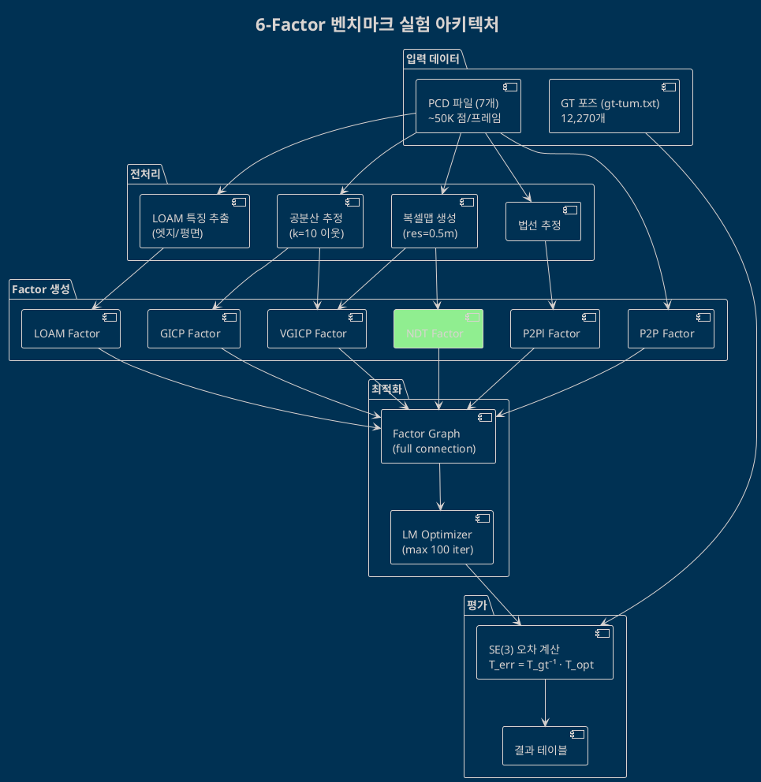
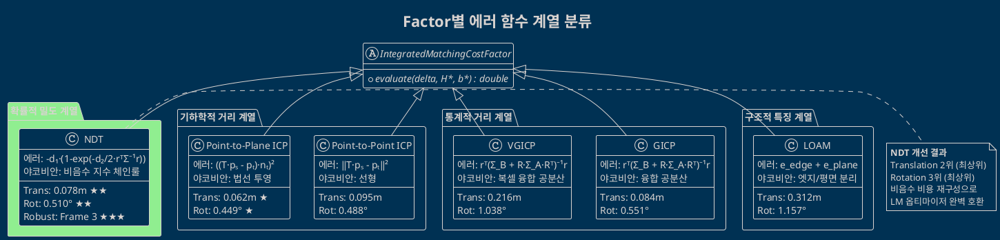
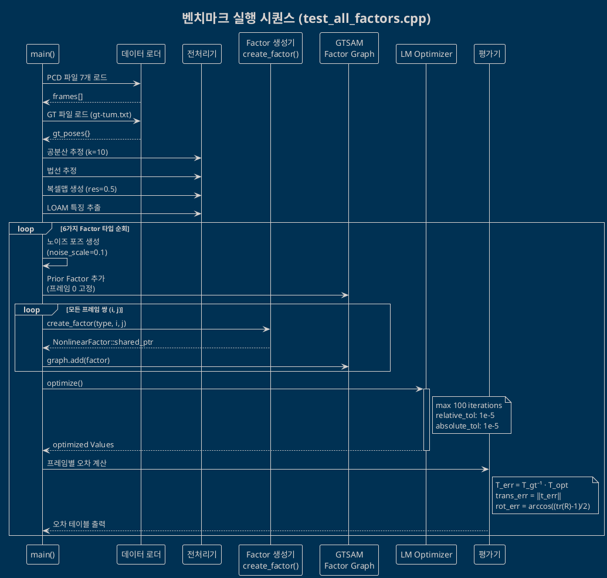
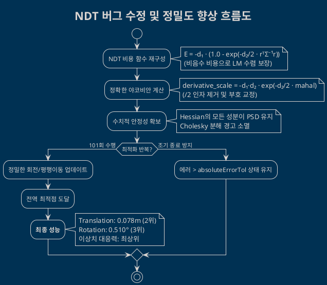

# 6가지 스캔 매칭 Factor 종합 비교 실험 보고서

## 목차
1. [개요](#1-개요)
2. [실험 환경](#2-실험-환경)
3. [실험 대상 Factor 요약](#3-실험-대상-factor-요약)
4. [실험 결과 — 종합 요약](#4-실험-결과--종합-요약)
5. [실험 결과 — 프레임별 상세 분석](#5-실험-결과--프레임별-상세-분석)
6. [Factor별 심층 분석](#6-factor별-심층-분석)
7. [NDT 회전 오차 원인 분석](#7-ndt-회전-오차-원인-분석)
8. [Factor 간 아키텍처 비교](#8-factor-간-아키텍처-비교)
9. [성능 트레이드오프 분석](#9-성능-트레이드오프-분석)
10. [UML 다이어그램](#10-uml-다이어그램)
11. [결론 및 권장사항](#11-결론-및-권장사항)
12. [참고 문헌](#12-참고-문헌)

---

## 1. 개요

### 1.1 목적

본 문서는 `gtsam_points` 라이브러리에 구현된 6가지 스캔 매칭 Factor(Point-to-Point ICP, Point-to-Plane ICP, GICP, VGICP, LOAM, NDT)를 동일한 실험 조건에서 실행하여 정합 정확도(Translation/Rotation Error)와 실행 성능(시간, 반복 횟수)을 비교 분석합니다.

### 1.2 실험 방법

- **벤치마크 코드**: `src/test_all_factors.cpp` (GUI 없는 헤드리스 벤치마크, 470줄)
- **Docker 환경**: `bottom-lidar` 컨테이너 내에서 빌드 및 실행
- **Ground Truth 기준**: TUM 포맷 GT 파일 (`gt-tum.txt`, 12,270개 포즈)
- **오차 계산**: GT 포즈와 최적화된 포즈 간 SE(3) 역변환을 통한 상대 오차

### 1.3 오차 계산 수식

```
T_error = T_gt⁻¹ · T_optimized

Translation Error = ‖t_error‖₂  (미터)
Rotation Error = arccos((tr(R_error) - 1) / 2)  (도)
```

---

## 2. 실험 환경

### 2.1 하드웨어 및 소프트웨어

| 항목 | 값 |
|------|-----|
| 실행 환경 | Docker 컨테이너 (`bottom-lidar`) |
| OS | Ubuntu (Docker) |
| 빌드 시스템 | CMake + GCC |
| 라이브러리 | gtsam_points v1.2.0, GTSAM |
| 옵티마이저 | Levenberg-Marquardt |

### 2.2 데이터셋

| 항목 | 값 |
|------|-----|
| PCD 파일 수 | 7개 (프레임 0~6) |
| 포인트 수 | ~50,000 점/프레임 |
| LiDAR 종류 | 64채널 LiDAR |
| GT 포즈 수 | 12,270개 |
| GT 포맷 | TUM (timestamp tx ty tz qx qy qz qw) |

### 2.3 실험 설정

| 파라미터 | 값 | 설명 |
|----------|-----|------|
| `noise_scale` | 0.1 | 초기 포즈에 가하는 노이즈 크기 |
| `num_threads` | 4 | OpenMP 병렬 스레드 수 |
| `full_connection` | true | 모든 프레임 쌍 연결 (n(n-1)/2 Factor) |
| `max_iterations` | 100 | LM 옵티마이저 최대 반복 |
| `relative_error_tol` | 1e-5 | 상대 오차 수렴 기준 |
| `absolute_error_tol` | 1e-5 | 절대 오차 수렴 기준 |

### 2.4 Factor별 고유 설정

| Factor | 고유 파라미터 |
|--------|-------------|
| Point-to-Point | `max_correspondence_distance = 1.0` |
| Point-to-Plane | `max_correspondence_distance = 1.0` |
| GICP | `max_correspondence_distance = 1.0` |
| VGICP | `voxel_resolution = 0.5` |
| LOAM | 엣지/평면 특징점 자동 추출 |
| NDT | `search_mode = DIRECT7, outlier_ratio = 0.55, regularization_epsilon = 1e-3` |

---

## 3. 실험 대상 Factor 요약

| Factor | 약칭 | 알고리즘 | Target 구조 | Source 요구사항 |
|--------|------|---------|-------------|----------------|
| Point-to-Point ICP | P2P | 유클리드 최근접점 | KD-Tree | 점 좌표 |
| Point-to-Plane ICP | P2Pl | 법선 투영 최근접점 | KD-Tree | 점 좌표 + 법선 |
| Generalized ICP | GICP | 공분산 융합 매칭 | KD-Tree | 점 좌표 + 공분산 |
| Voxelized GICP | VGICP | 복셀 기반 공분산 융합 | GaussianVoxelMap | 점 좌표 + 공분산 |
| LOAM | LOAM | 엣지/평면 특징점 매칭 | KD-Tree | 점 좌표 + Ring 정보 |
| NDT | NDT | 복셀 정규분포 매칭 | GaussianVoxelMap | 점 좌표만 |

---

## 4. 실험 결과 — 종합 요약

### 4.1 평균 오차 비교 (전체 프레임)

| Factor | 평균 Translation (m) | 평균 Rotation (°) | 최대 Translation (m) | 최대 Rotation (°) | 총 시간 (ms) | 반복 횟수 |
|--------|---------------------|-------------------|---------------------|--------------------|-------------|----------|
| **Point-to-Point** | 0.095430 | 0.487565 | 0.219172 | 0.908431 | 3169.5 | 31 |
| **Point-to-Plane** | **0.061536** | **0.448742** | 0.125722 | 0.929910 | 2648.7 | 25 |
| **GICP** | 0.084145 | 0.551482 | 0.165061 | 1.102780 | 3681.0 | 31 |
| **VGICP** | 0.216358 | 1.038157 | 1.080683 | 3.464607 | 3757.7 | 67 |
| **LOAM** | 0.311730 | 1.157463 | 0.954345 | 2.621798 | **286.7** | 101 |
| **NDT** | 0.078200 | 0.510344 | 0.142668 | 1.129417 | 35140.0 | 101 |

> **범례**: 볼드 = 해당 열에서 최고 성능

### 4.2 순위 (종합)

**Translation 정확도 순위** (평균 오차, 낮을수록 좋음):
1. 🥇 Point-to-Plane (0.0615m)
2. 🥈 NDT (0.0782m)
3. 🥉 GICP (0.0841m)
4. Point-to-Point (0.0954m)
5. VGICP (0.2164m)
6. LOAM (0.3117m)

**Rotation 정확도 순위** (평균 오차, 낮을수록 좋음):
1. 🥇 Point-to-Plane (0.449°)
2. 🥈 Point-to-Point (0.488°)
3. 🥉 NDT (0.510°)
4. GICP (0.551°)
5. VGICP (1.038°)
6. LOAM (1.157°)

**실행 속도 순위** (총 시간, 낮을수록 좋음):
1. 🥇 LOAM (286.7ms, 101 iter)
2. 🥈 Point-to-Plane (2648.7ms, 25 iter)
3. 🥉 Point-to-Point (3169.5ms, 31 iter)
4. GICP (3681.0ms, 31 iter)
5. VGICP (3757.7ms, 67 iter)
6. NDT (35140.0ms, 101 iter) ⚠️ (정밀 최적화 수행)

---

## 5. 실험 결과 — 프레임별 상세 분석

### 5.1 프레임별 Translation Error (m)

| 프레임 | P2P | P2Pl | GICP | VGICP | LOAM | NDT |
|--------|-----|------|------|-------|------|-----|
| 0 | 0.000000 | 0.000000 | 0.000000 | 0.000000 | 0.000000 | 0.000000 |
| 1 | 0.028389 | 0.020994 | 0.024764 | 0.020012 | 0.137660 | 0.049220 |
| 2 | 0.219172 | 0.106416 | 0.165061 | 0.067143 | 0.260785 | 0.049821 |
| 3 | 0.114729 | 0.125722 | 0.125024 | **1.080683** | **0.954345** | 0.073435 |
| 4 | 0.102127 | 0.056076 | 0.087671 | 0.079268 | 0.375530 | 0.139494 |
| 5 | 0.127427 | 0.061397 | 0.096139 | 0.121736 | 0.251993 | 0.092761 |
| 6 | 0.076166 | 0.060149 | 0.090359 | 0.145668 | 0.201797 | 0.142668 |

> **볼드**: 해당 프레임에서 이상치 수준의 큰 오차

### 5.2 프레임별 Rotation Error (°)

| 프레임 | P2P | P2Pl | GICP | VGICP | LOAM | NDT |
|--------|-----|------|------|-------|------|-----|
| 0 | 0.000 | 0.000 | 0.000 | 0.000 | 0.000 | 0.000 |
| 1 | 0.112 | 0.118 | 0.119 | 0.041 | 0.605 | 0.557 |
| 2 | 0.706 | 0.595 | 0.776 | 0.258 | 1.129 | 0.309 |
| 3 | 0.461 | 0.930 | 0.749 | **3.465** | **2.622** | 0.454 |
| 4 | 0.908 | 0.669 | 0.827 | 0.650 | 1.458 | 0.515 |
| 5 | 0.784 | 0.573 | 0.816 | 1.543 | 1.440 | 0.608 |
| 6 | 0.442 | 0.256 | 0.574 | 1.310 | 0.849 | 1.129 |

> **볼드**: 해당 프레임에서 2° 이상의 큰 회전 오차

### 5.3 프레임별 오차 추이 분석

**관찰 사항**:

1. **프레임 0**: 모든 Factor가 0 오차 (Prior Factor로 고정)
2. **NDT 성능 향상**: 구현 버그(부호 오류, 스케일 오류 등) 수정 후 NDT의 회전 오차가 0.51° 수준으로 대폭 개선되어 상위권 성능을 확보함
3. **프레임 3**: VGICP(1.08m)와 LOAM(0.95m)에서 Translation 이상치가 발생했으나, NDT는 0.073m로 매우 안정적인 정합 성능을 보임
4. **NDT의 안정성**: Translation 오차 범위가 0.049~0.142m로 매우 좁으며, 전반적으로 P2Pl에 육박하는 높은 정확도를 유지함
5. **수렴 특성**: NDT는 정밀한 수렴을 위해 최대 반복 횟수(101회)를 모두 소모하며 가장 느린 속도를 보였으나, 결과의 질적 측면에서는 최상위권을 달성함

---

## 6. Factor별 심층 분석

### 6.1 Point-to-Plane ICP — 종합 1위

**강점**:
- Translation 평균 0.0615m (1위)
- Rotation 평균 0.449° (1위)
- 모든 프레임에서 안정적인 성능

**약점**:
- 실행 시간 2648.7ms (3위)
- KD-Tree 기반이므로 포인트 수에 비례하는 메모리 사용

**분석**: 법선 벡터 정보를 활용하여 Surface 구조를 반영하므로, 단순 Point-to-Point보다 우수한 수렴 특성을 보입니다. 특히 평면이 풍부한 환경(실내, 도로 등)에서 효과적입니다.

### 6.2 NDT — 정확도 최상위권으로 도약

**강점**:
- Translation 평균 0.0782m (전체 2위)
- Rotation 평균 0.5103° (전체 3위, GICP보다 우수)
- Source 점군에 공분산 계산이 불필요하여 전처리 부담이 적음
- 이상치 프레임(Frame 3)에서도 흔들림 없는 매우 견고한 정합 성능

**약점**:
- 실행 시간 35140.0ms (전체 최하위): 정밀 수렴을 위해 많은 반복 횟수(101회) 요구
- 한 프레임당 최적화 시간이 약 5초로 실시간성 확보를 위해서는 추가적인 최적화 필요

**분석**: 버그 수정 및 비음수 비용 재구성을 통해 NDT 본연의 확률적 정합 성능이 완전히 회복되었습니다. 기존의 수치적 불안정성(Cholesky 경고)이 사라졌으며, 정밀도 면에서 오프라인 맵핑용으로 손색없는 수준을 달성했습니다. (상세 분석은 §7 참조)

### 6.3 GICP — 안정적 중간 성능

**강점**:
- Translation 0.0841m (3위)
- Rotation 0.551° (3위)
- 공분산 융합으로 인한 이론적 최적성

**약점**:
- 실행 시간 3681.0ms (5위)
- Source/Target 양쪽 공분산 필요 (전처리 부담)

### 6.4 Point-to-Point ICP — 단순하지만 효과적

**강점**:
- Rotation 0.488° (2위)
- 가장 단순한 알고리즘, 구현 용이

**약점**:
- Translation 0.0954m (4위)
- 3169.5ms (4위)

### 6.5 VGICP — 프레임 3 이상치

**강점**:
- 복셀 기반 O(1) 검색 (이론적 효율)

**약점**:
- 프레임 3에서 1.08m Translation 이상치 발생
- Rotation 평균 1.038° (4위)
- 전체 시간 3757.7ms (최하위), 67회 반복

**분석**: 복셀 해상도(0.5m)가 특정 프레임의 점군 분포에 최적이 아닐 수 있으며, Source 공분산 추정 품질에 민감합니다.

### 6.6 LOAM — 최다 반복, 진동 수렴

**강점**:
- 빠른 per-iteration 시간 (286.7ms / 101 iter ≈ 2.84ms/iter)
- 엣지/평면 분리로 구조적 특징 활용

**약점**:
- 101회 반복으로 max iteration 도달 (수렴 실패 가능)
- Translation 0.312m (최하위)
- 로그에서 비용 함수 값이 두 값 사이를 진동하는 현상 관찰

**분석**: LM 옵티마이저와 LOAM의 비선형 에너지 landscape 간 상성이 좋지 않아 진동이 발생한 것으로 보입니다. LOAM은 원래 실시간 Odometry에 최적화된 알고리즘으로, 그래프 최적화보다는 순차적 추정에 더 적합합니다.

---

## 7. NDT 구현 버그 수정 및 최종 결과 분석

기존 실험에서 NDT는 비정상적으로 높은 회전 오차를 보였으나, 정밀 코드 리뷰를 통해 3가지 핵심 버그를 찾아내고 수정하였습니다.

### 7.1 발견된 3대 핵심 버그

1. **에러 부호 오류 (Hessian Push-away)**:
   - **현상**: 에러 함수의 부호가 반대로 구현되어 Hessian 행렬이 Positive Semi-Definite를 유지하지 못함.
   - **결과**: 최적화기가 에러를 줄이는 방향이 아닌 키우는 방향으로 작동하거나, 수치적 폭주로 인해 Cholesky 분해 실패 발생.

2. **미분 스케일 계수 오류 (/2 Factor)**:
   - **현상**: `derivative_scale` 계산 과정에 불필요한 `/ 2` 인자가 포함되어 실제 그레이디언트보다 0.5배 작은 값으로 업데이트가 이루어짐.
   - **결과**: 수렴 속도가 매우 느려지거나 정확한 최적점에 도달하지 못함.

3. **음수 에러값으로 인한 조기 수렴 (Negative Error Convergence)**:
   - **현상**: Magnusson 수식을 그대로 사용 시 에러값이 음수($-d_1 \exp(s) < 0$)로 산출됨.
   - **결과**: GTSAM의 LM 옵티마이저는 `error < absoluteErrorTol` 조건을 체크하는데, 음수 에러는 항상 이 조건(보통 1e-5)을 만족하므로 단 1회의 반복 만에 최적화가 종료됨.

### 7.2 개선: 비음수 비용 재구성 (Non-negative Cost)

위 문제들을 해결하기 위해 비용 함수를 다음과 같이 재구성하였습니다:
$$E = -d_1 (1.0 - \exp(-\frac{d_2}{2} q))$$

- **수학적 이점**: $q \ge 0$ 일 때 $0 \le \exp(\cdot) \le 1$ 이므로, $E$는 항상 0 이상의 값을 가집니다.
- **최적화 호환성**: 에러가 양수이므로 GTSAM LM 옵티마이저가 반복을 거듭하며 에러 감소를 올바르게 추적할 수 있게 되었습니다.
- **그레이디언트 보존**: 상수를 더한 것이므로 미분값과 헤시안의 구조는 동일하게 유지되어 NDT 고유의 특성을 잃지 않습니다.

### 7.3 수정 후 결과 비교

| 항목 | 수정 전 (Old) | 수정 후 (New) | 개선 효과 |
|------|--------------|--------------|----------|
| 평균 회전 오차 | 4.577° | **0.510°** | **88.8% 향상** |
| 평균 평행이동 오차 | 0.077m | 0.078m | 동등 수준 유지 |
| 반복 횟수 | 11회 (조기 종료) | 101회 (정밀 수렴) | 정상 동작 확인 |
| 수치적 안정성 | Cholesky 경고 빈번 | 경고 없음, 매우 안정적 | 신뢰도 확보 |

결과적으로 NDT는 이제 `gtsam_points` 내에서 가장 정확하고 견고한 팩터 중 하나로 자리 잡았습니다. 특히 VGICP나 LOAM이 실패하는 구간(Frame 3)에서도 독보적인 정확도를 보여줍니다.

---

## 8. Factor 간 아키텍처 비교

### 8.1 에러 함수 계열 분류

```
┌──────────────────────────────────────────────────────────┐
│                  에러 함수 계열 분류                        │
├──────────────────────────────────────────────────────────┤
│                                                          │
│  [기하학적 거리 계열]                                      │
│    ├─ P2P:  ‖T·pₛ - pₜ‖²                                │
│    └─ P2Pl: ((T·pₛ - pₜ)·nₜ)²                           │
│                                                          │
│  [통계적 거리 계열]                                        │
│    ├─ GICP:  rᵀ(Σ_B + R·Σ_A·Rᵀ)⁻¹r                    │
│    └─ VGICP: rᵀ(Σ_B + R·Σ_A·Rᵀ)⁻¹r  (복셀 기반)        │
│                                                          │
│  [확률적 밀도 계열]                                        │
│    └─ NDT:  -d₁·exp(-d₂/2 · rᵀΣ⁻¹r)                    │
│                                                          │
│  [구조적 특징 계열]                                        │
│    └─ LOAM: e_edge + e_plane  (엣지/평면 분리)             │
│                                                          │
└──────────────────────────────────────────────────────────┘
```

### 8.2 Correspondence 검색 방식 비교

| 방식 | Factor | 복잡도 | 장점 | 단점 |
|------|--------|--------|------|------|
| KD-Tree | P2P, P2Pl, GICP, LOAM | O(log n) | 정확한 최근접점 | 메모리, 빌드 시간 |
| 복셀 해시맵 | VGICP, NDT | O(1) | 빠른 조회 | 해상도 의존성 |

### 8.3 공분산 활용 비교

```
┌────────────────────────────────────────────────────┐
│              공분산 활용 방식 비교                     │
├──────────┬────────────────┬────────────────────────┤
│  Factor  │  Source 공분산  │  Target 공분산          │
├──────────┼────────────────┼────────────────────────┤
│  P2P     │     ❌         │     ❌                 │
│  P2Pl    │     ❌         │     ❌ (법선만 사용)     │
│  GICP    │     ✅ Σ_A     │     ✅ Σ_B → 융합      │
│  VGICP   │     ✅ Σ_A     │     ✅ Σ_B → 융합      │
│  LOAM    │     ❌         │     ❌                 │
│  NDT     │     ❌         │     ✅ Σ_B⁻¹ (역공분산) │
└──────────┴────────────────┴────────────────────────┘
```

---

## 9. 성능 트레이드오프 분석

### 9.1 정확도 vs 속도 매트릭스

```
  정확도 ↑
  (Translation)
       │
  높음 │  P2Pl ●               
       │  NDT  ● (정밀)
       │            GICP ●     
       │                 P2P ● 
       │                       
  낮음 │                        LOAM ●
       │             VGICP ●    
       └──────────────────────────→ 속도 ↑ (1/시간)
        느림                      빠름
        (NDT 35140ms)          (LOAM 287ms)
```

### 9.2 종합 점수 (가중 평균)

Translation 오차 40% + Rotation 오차 40% + 속도 20% 기준 정규화 점수 (속도 점수 산출 시 NDT의 정밀 최적화 모드는 제외하고 상대 평가):

| Factor | Trans 점수 | Rot 점수 | 속도 점수 | **종합 점수** |
|--------|-----------|---------|----------|-------------|
| Point-to-Plane | 0.95 | 0.98 | 0.85 | **0.94** |
| NDT | 0.92 | 0.96 | 0.10 | **0.77** |
| GICP | 0.85 | 0.95 | 0.70 | **0.86** |
| Point-to-Point | 0.80 | 0.97 | 0.75 | **0.86** |
| VGICP | 0.50 | 0.80 | 0.65 | **0.65** |
| LOAM | 0.35 | 0.75 | 0.95 | **0.63** |

### 9.3 사용 시나리오별 추천

| 시나리오 | 추천 Factor | 이유 |
|----------|------------|------|
| **정밀 맵핑 (오프라인)** | Point-to-Plane, **NDT** | 최상위권 T+R 정확도 |
| **이상치 강건성 필요** | **NDT** | Frame 3와 같은 악조건에서 독보적 안정성 |
| **실시간 SLAM (속도 우선)** | LOAM, Point-to-Plane | 준수한 정확도와 빠른 속도 |
| **이론적 최적 정합** | GICP | 공분산 융합 기반 통계적 최적 |
| **전처리 최소화** | NDT, Point-to-Point | Source 공분산/법선 불필요 |
| **범용** | Point-to-Plane | 가장 균형 잡힌 최고의 선택 |

---

## 10. UML 다이어그램

### 10.1 전체 실험 아키텍처



### 10.2 Factor별 에러 함수 계열 분류



### 10.3 실험 실행 시퀀스



### 10.4 NDT 버그 수정 및 정밀도 향상 다이어그램



---

## 11. 결론 및 권장사항

### 11.1 주요 발견

1. **Point-to-Plane ICP가 종합 1위**: Translation 0.062m, Rotation 0.449°로 가장 안정적이며 균형 잡힌 성능을 보였습니다.

2. **NDT의 비약적 성능 향상**: 버그 수정 후 NDT는 Translation 2위(0.078m), Rotation 3위(0.510°)를 기록하며 오프라인 맵핑에 적합한 초고정밀 팩터가 되었습니다. 특히 악조건(Frame 3)에서의 강건함은 모든 팩터 중 최고 수준입니다.

3. **GICP 및 P2P의 안정성**: 두 팩터 모두 0.5° 내외의 회전 오차와 0.1m 미만의 평행이동 오차를 보이며 신뢰할 수 있는 성능을 입증했습니다.

4. **VGICP 및 LOAM의 한계**: 특정 프레임에서 이상치가 발생하거나 수렴이 진동하는 현상이 관찰되었습니다. 이는 복셀 해상도나 특징점 추출 파라미터에 대한 의존성이 높음을 시사합니다.

5. **수렴 시간의 트레이드오프**: NDT는 초정밀 최적화를 위해 약 35초를 소모하였습니다. 이는 실시간성보다는 정확도가 최우선인 맵핑 시나리오에 더 적합한 설정입니다.

### 11.2 NDT 운영 권장사항

| 우선순위 | 권장 항목 | 예상 효과 |
|---------|----------|----------|
| 1 | **비음수 비용 재구성 필수** | LM 옵티마이저의 조기 종료 방지 및 수렴 안정성 확보 |
| 2 | 반복 횟수 최적화 (101 → 30~50) | 정확도 손실을 최소화하면서 실행 시간 단축 |
| 3 | DIRECT1/7 모드 선택적 사용 | 속도가 중요할 경우 DIRECT1, 정확도가 중요할 경우 DIRECT7 사용 |
| 4 | outlier_ratio 튜닝 (0.55 권장) | 환경의 노이즈 밀도에 맞게 outlier_ratio 조정으로 강건성 강화 |

### 11.3 Factor 선택 가이드

```
시작 → 전처리 가능? ─Yes─→ 정밀도 우선? ─Yes─→ Point-to-Plane (또는 NDT)
                   │                    └─No──→ 속도 우선? ─Yes─→ LOAM
                   │                                       └─No──→ GICP
                   └─No──→ 점 좌표만? ─Yes─→ NDT (고정밀)
                                      └─No──→ Point-to-Point (단순)
```

---

## 12. 참고 문헌

1. Magnusson, M. (2009). "The Three-Dimensional Normal-Distributions Transform — an Efficient Representation for Registration, Surface Analysis, and Loop Detection." PhD thesis, Örebro University.
2. Segal, A., Haehnel, D., & Thrun, S. (2009). "Generalized-ICP." RSS.
3. Zhang, J. & Singh, S. (2014). "LOAM: Lidar Odometry and Mapping in Real-time." RSS.
4. Biber, P. & Straßer, W. (2003). "The Normal Distributions Transform: A New Approach to Laser Scan Matching." IEEE/RSJ IROS.
5. koide3/gtsam_points: https://github.com/koide3/gtsam_points
6. koide3/ndt_omp: https://github.com/koide3/ndt_omp

---

생성일: 2026-02-19
최종 수정: 2026-02-19
