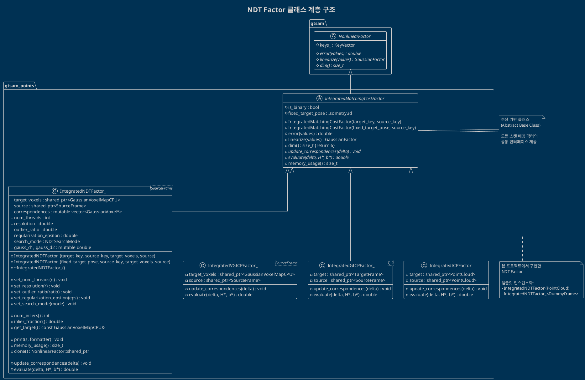
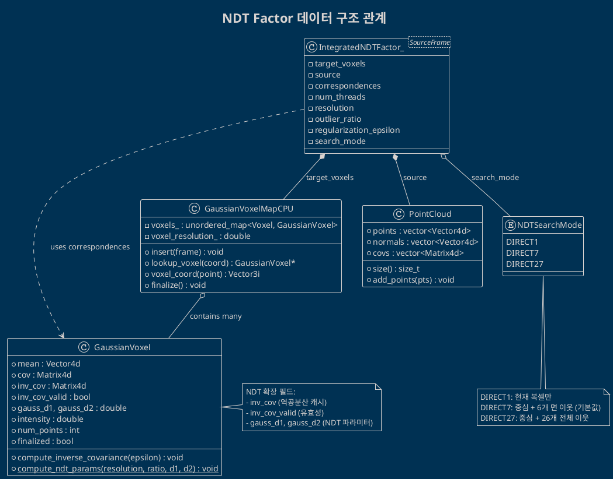
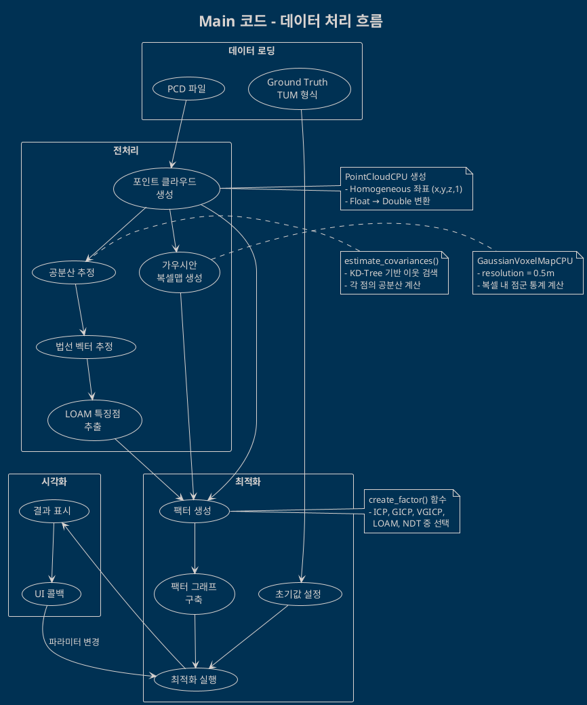
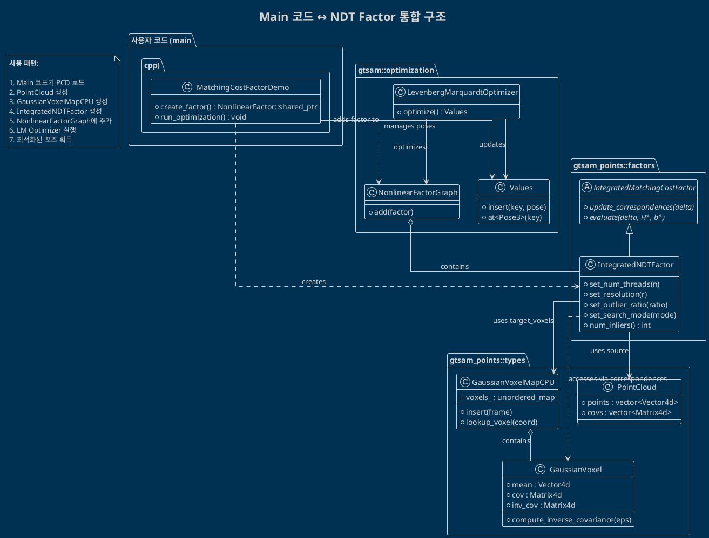
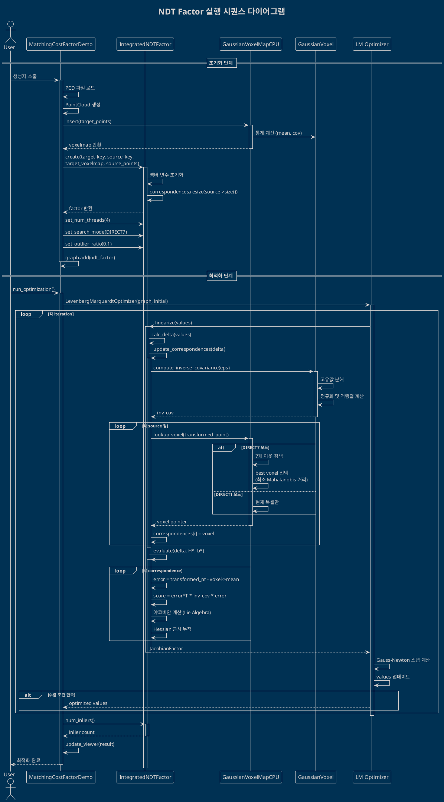
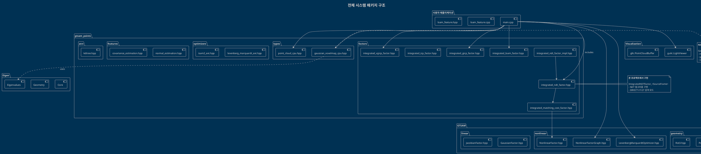
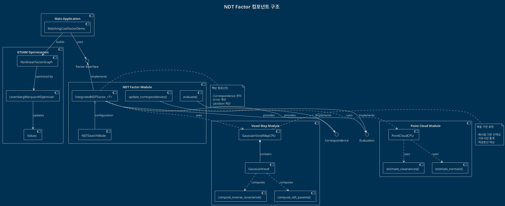

# NDT Factor 구현 - UML 다이어그램

이 문서는 NDT Factor 구현과 Main 코드의 구조를 PlantUML 다이어그램으로 시각화합니다.

---

## 1. NDT Factor 클래스 계층 구조

### 1.1 Factor 상속 계층



### 1.2 NDT Factor 데이터 구조



---

## 2. Main 코드 구조

### 2.1 MatchingCostFactorDemo 클래스

```plantuml
@startuml main_class_structure
!theme blueprint

title Main 코드 - MatchingCostFactorDemo 클래스 구조

class MatchingCostFactorDemo {
  -frames : vector<PointCloud::ConstPtr>
  -voxelmaps : vector<GaussianVoxelMap::ConstPtr>
  -frames_with_ring : vector<PointWithRing>
  -loam_features : vector<LOAMFeatures>
  -poses : Values
  -poses_gt : Values
  
  -pose_noise_scale : float
  -optimizer_type : int
  -optimizer_types : vector<string>
  -factor_type : int
  -factor_types : vector<string>
  -full_connection : bool
  -num_threads : int
  -correspondence_update_tolerance_rot : float
  -correspondence_update_tolerance_trans : float
  
  -optimization_thread : thread
  
  +MatchingCostFactorDemo()
  +~MatchingCostFactorDemo()
  -update_viewer(values) : void
  -create_factor(target_key, source_key, ...) : NonlinearFactor::shared_ptr
  -run_optimization() : void
}

package "gtsam_points::factors" {
  class IntegratedICPFactor
  class IntegratedGICPFactor
  class IntegratedVGICPFactor
  class IntegratedLOAMFactor
  class IntegratedNDTFactor
}

package "gtsam" {
  class NonlinearFactorGraph {
    +add(factor) : void
    +error(values) : double
  }
  
  class Values {
    +insert(key, value) : void
    +at<T>(key) : T
    +update(key, value) : void
  }
  
  class LevenbergMarquardtOptimizer {
    +optimize() : Values
  }
  
  class ISAM2 {
    +update(graph, values) : void
    +calculateEstimate() : Values
  }
}

package "gtsam_points::types" {
  class PointCloud {
    +points : vector<Vector4d>
    +size() : size_t
  }
  
  class GaussianVoxelMapCPU {
    +insert(frame) : void
    +lookup_voxel(coord) : GaussianVoxel*
  }
}

package "visualization" {
  class "guik::LightViewer" as LightViewer {
    +{static} instance() : LightViewer*
    +update_drawable(name, buffer, style) : void
    +register_ui_callback(name, callback) : void
  }
}

MatchingCostFactorDemo ..> IntegratedICPFactor : creates
MatchingCostFactorDemo ..> IntegratedGICPFactor : creates
MatchingCostFactorDemo ..> IntegratedVGICPFactor : creates
MatchingCostFactorDemo ..> IntegratedLOAMFactor : creates
MatchingCostFactorDemo ..> IntegratedNDTFactor : creates

MatchingCostFactorDemo --> NonlinearFactorGraph : builds
MatchingCostFactorDemo --> Values : manages poses
MatchingCostFactorDemo --> LevenbergMarquardtOptimizer : uses
MatchingCostFactorDemo --> ISAM2 : uses

MatchingCostFactorDemo o-- PointCloud : stores frames
MatchingCostFactorDemo o-- GaussianVoxelMapCPU : stores voxelmaps

MatchingCostFactorDemo ..> LightViewer : visualizes with

note right of MatchingCostFactorDemo
  Main 애플리케이션 클래스
  
  지원하는 Factor 타입:
  0: Point-to-Point ICP
  1: Point-to-Plane ICP
  2: GICP
  3: VGICP
  4: LOAM
  5: NDT (추가됨)
  
  Optimizer 타입:
  0: Levenberg-Marquardt
  1: ISAM2
end note

@enduml
```



### 2.2 Main 코드 데이터 흐름



---

## 3. NDT Factor 통합 다이어그램

### 3.1 Main 코드와 NDT Factor 통합



### 3.2 NDT Factor 실행 시퀀스



---

## 4. 패키지 다이어그램

### 4.1 전체 시스템 패키지 구조



---

## 5. 컴포넌트 다이어그램

### 5.1 NDT Factor 컴포넌트 구조



---

## 다이어그램 렌더링 방법

### 1. PlantUML 온라인 에디터

- **URL**: https://www.plantuml.com/plantuml/uml/
- 위 다이어그램 코드를 복사하여 붙여넣기
- 자동으로 렌더링된 이미지 확인

### 2. VS Code 확장

```bash
# PlantUML 확장 설치
code --install-extension jebbs.plantuml

# Java 설치 (필요시)
sudo apt install default-jre

# Graphviz 설치 (필요시)
sudo apt install graphviz
```

**사용법**:
- `.puml` 또는 `.plantuml` 파일 생성
- `Alt+D` 키로 미리보기 실행

### 3. 명령줄 도구

```bash
# PlantUML JAR 다운로드
wget https://github.com/plantuml/plantuml/releases/download/v1.2024.0/plantuml-1.2024.0.jar

# PNG 이미지 생성
java -jar plantuml.jar diagram.puml

# SVG 벡터 이미지 생성
java -jar plantuml.jar -tsvg diagram.puml
```

### 4. Docker 사용

```bash
# PlantUML 서버 실행
docker run -d -p 8080:8080 plantuml/plantuml-server:jetty

# 브라우저에서 http://localhost:8080 접속
```

---

**문서 버전**: 1.0  
**최종 수정일**: 2026-02-13  
**관련 문서**: [ndt_factor_detailed_ko.md](./ndt_factor_detailed_ko.md)
