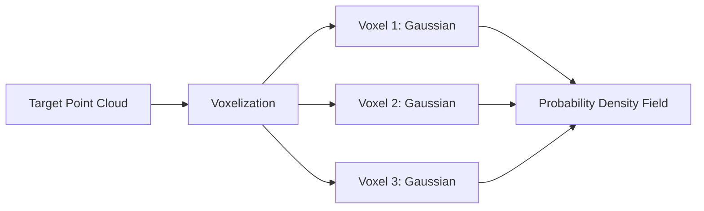
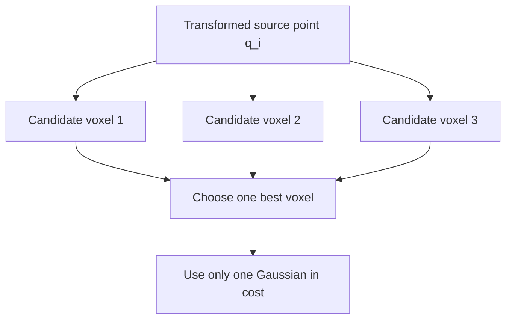
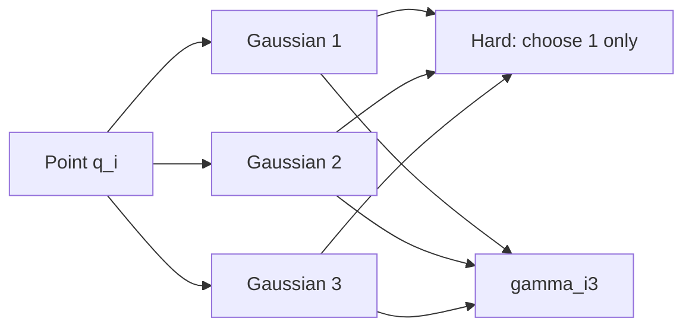
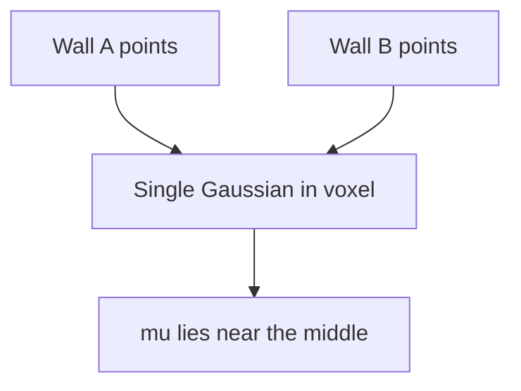
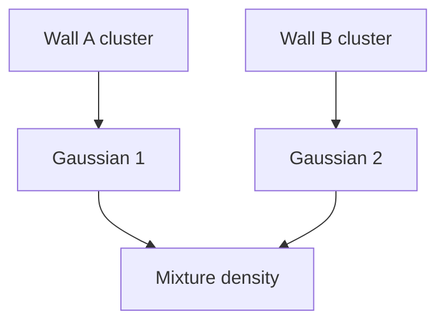

# NDT vs NDT+Mixture Model 수학 상세 설명 (2026-03-16)

## 0) 문서 목적

이 문서는 다음 질문에 답하기 위해 작성한다.

1. `NDT`는 수학적으로 무엇을 최적화하는가?
2. `NDT + Mixture Model`은 무엇이 추가된 모델인가?
3. hard assignment와 soft assignment는 수식적으로 어떻게 다른가?
4. 왜 mixture model이 복셀 경계/다중 표면 문제를 완화할 수 있는가?

이 문서는 구현 세부보다 **수학적 구조와 확률적 해석**에 집중한다.

---

## 1) 한 줄 요약

- **NDT**: 각 복셀을 **단일 Gaussian**으로 보고, 변환된 소스 점이 그 분포에서 얼마나 그럴듯한지 평가한다.
- **NDT + Mixture Model**: 각 점이 **여러 Gaussian 성분**에 확률적으로 대응할 수 있게 만들어, hard voxel 선택을 soft likelihood 합으로 바꾼다.

즉 핵심 차이는:

```text
NDT                = one voxel / one Gaussian / hard assignment
NDT + Mixture      = multiple candidate Gaussians / soft assignment / responsibility gamma
```

---

## 2) 기호 정의

문서 전체에서 아래 기호를 고정한다.

- 소스 점군: $A = \{\mathbf{x}_i\}_{i=1}^N$
- 타깃 맵: $B$
- 포즈 파라미터: $\theta \in SE(3)$
- 변환된 소스 점: $\mathbf{q}_i(\theta) = T(\theta) \mathbf{x}_i$
- 복셀/성분 평균: $\boldsymbol{\mu}_k$
- 복셀/성분 공분산: $\boldsymbol{\Sigma}_k$
- Mahalanobis 거리:

$$
m_{ik}(\theta) = (\mathbf{q}_i(\theta)-\boldsymbol{\mu}_k)^T \boldsymbol{\Sigma}_k^{-1} (\mathbf{q}_i(\theta)-\boldsymbol{\mu}_k)
$$

---

## 3) NDT의 기본 아이디어

기본 NDT는 타깃 점군을 직접 점 집합으로 쓰지 않고, 공간을 복셀로 나눈 뒤 각 복셀 안의 점 분포를 **정규분포 하나**로 근사한다.

즉 타깃은 다음과 같은 확률 밀도장으로 바뀐다.

```text
voxel k  ->  N(mu_k, Sigma_k)
```

### 3.1 컨셉 그림: 점군 -> 복셀 Gaussian 맵



직관적으로는:

- ICP/GICP는 "어느 점과 대응하느냐"를 직접 찾는 방식이고
- NDT는 "이 점이 어떤 복셀 분포 안에서 얼마나 그럴듯한가"를 보는 방식이다.

---

## 4) NDT의 수학

### 4.1 단일 Gaussian likelihood

변환된 소스 점 $\mathbf{q}_i(\theta)$가 복셀 $k(i)$의 Gaussian에 속할 likelihood는:

$$
p(\mathbf{q}_i(\theta) \mid k(i)) \propto \exp\left(-\frac{1}{2} m_{i,k(i)}(\theta)\right)
$$

즉 Mahalanobis 거리가 작을수록 likelihood가 높다.

### 4.2 전통적인 NDT score

Magnusson 계열 설명에서 자주 나오는 score 형태는 다음처럼 쓸 수 있다.

$$
s(\theta) = \sum_i \exp\left(-\frac{1}{2} m_{i,k(i)}(\theta)\right)
$$

또는 구현에 따라 outlier 혼합을 포함한 형태:

$$
s(\theta) = -\sum_i d_1 \exp\left(-\frac{d_2}{2} m_{i,k(i)}(\theta)\right)
$$

여기서 $d_1, d_2$는 outlier 비율과 해상도에서 유도되는 상수다.

### 4.3 코드 구현에서 흔한 cost 형태

실제 구현에서는 optimizer가 최소화를 하므로 비음수 cost로 다시 쓴다.

예를 들면:

$$
E_{\text{NDT}}(\theta) = \sum_i -d_1 \left(1 - \exp\left(-\frac{d_2}{2} m_{i,k(i)}(\theta)\right)\right)
$$

이 식의 의미는:

- 정렬이 잘 되면 $m_{ik}$가 작아져 cost가 0에 가까움
- 멀어지면 cost가 증가하지만, 단순 이차식처럼 무한정 커지는 대신 포화형 성격을 가짐

---

## 5) NDT의 hard assignment

기본 NDT에서 중요한 점은, 각 포인트가 **하나의 복셀/하나의 Gaussian**에 대응한다는 것이다.

즉 실제 계산은 다음과 같은 hard decision을 포함한다.

$$
k(i) = \arg\min_k m_{ik}(\theta)
$$

그리고 목적함수는 그 하나의 성분만 사용한다.

$$
E_{\text{NDT}}(\theta) = \sum_i \phi\big(m_{i,k(i)}(\theta)\big)
$$

여기서 $\phi(\cdot)$는 지수형 score 또는 그 변형 cost다.

### 5.1 컨셉 그림: hard assignment



### 5.2 hard assignment의 장단점

장점:

- 계산이 단순하다
- 구현이 쉽다
- 복셀 기반이어서 nearest-neighbor ICP보다 구조적 대응이 부드럽다

한계:

- voxel 경계에서 대응이 갑자기 바뀔 수 있다
- 한 복셀 안에 여러 표면이 섞이면 Gaussian 1개로 표현력이 부족하다
- 코너, 두 벽, 복합 구조에서 평균 하나로 뭉개질 수 있다

---

## 6) 왜 Mixture Model을 붙이려 하는가

기본 NDT는 복셀당 Gaussian 하나를 둔다. 하지만 실제 환경은 종종 **다중 모드(multi-modal)** 구조를 가진다.

대표 예:

- 코너
- 복셀 하나에 두 벽이 동시에 들어간 경우
- 복셀 경계 근처에서 두 후보가 비슷하게 그럴듯한 경우

이 경우 단일 Gaussian은 다음 문제를 만든다.

1. 평균이 실제 표면 위가 아니라 중간 공간으로 당겨질 수 있음
2. 공분산이 과도하게 커져 방향성이 흐려질 수 있음
3. 최적화가 hard switch 때문에 불연속적으로 흔들릴 수 있음

---

## 7) NDT + Mixture Model의 핵심 수학

Mixture Model 버전은 각 포인트가 여러 Gaussian 성분에 확률적으로 대응할 수 있다고 본다.

### 7.1 Gaussian mixture density

점 $\mathbf{q}_i(\theta)$에 대한 mixture likelihood는:

$$
p(\mathbf{q}_i(\theta)) = \pi_0 c_0 + \sum_{k \in \mathcal{K}_i} \pi_k \; \mathcal{N}(\mathbf{q}_i(\theta) \mid \boldsymbol{\mu}_k, \boldsymbol{\Sigma}_k)
$$

여기서:

- $\pi_k$: mixture weight
- $\mathcal{K}_i$: 포인트 $i$가 고려하는 후보 Gaussian 집합
- $\pi_0 c_0$: uniform outlier 항

즉 포인트 하나가 여러 후보를 동시에 가진다.

### 7.2 전체 목적함수: log-sum-exp 구조

정확한 음의 로그우도는 다음처럼 된다.

$$
F(\theta) = -\sum_i \log\left( \pi_0 c_0 + \sum_{k \in \mathcal{K}_i} \pi_k \; \mathcal{N}(\mathbf{q}_i(\theta) \mid \boldsymbol{\mu}_k, \boldsymbol{\Sigma}_k) \right)
$$

이 식이 핵심이다.

- NDT는 "한 개 선택" 구조였다면
- Mixture는 "여러 개 likelihood의 합의 로그"가 된다

즉 hard assignment가 아니라 **soft assignment**가 된다.

---

## 8) responsibility(책임도) \(\gamma\)

Mixture model에서 핵심 변수는 책임도(responsibility)다.

$$
\gamma_{ik}(\theta_0) = 
\frac{\pi_k \; \mathcal{N}(\mathbf{q}_i(\theta_0) \mid \boldsymbol{\mu}_k, \boldsymbol{\Sigma}_k)}
{\pi_0 c_0 + \sum_{j \in \mathcal{K}_i} \pi_j \; \mathcal{N}(\mathbf{q}_i(\theta_0) \mid \boldsymbol{\mu}_j, \boldsymbol{\Sigma}_j)}
$$

의미:

- 포인트 $i$가 성분 $k$에 속할 posterior probability
- hard assignment에서는 한 성분만 1, 나머지 0에 가까움
- mixture에서는 여러 성분이 동시에 기여 가능

### 8.1 컨셉 그림: hard vs soft assignment



---

## 9) 왜 soft assignment가 더 부드러운가

hard assignment는 사실상:

$$
\log\sum_k e^{z_k} \approx \max_k z_k
$$

같은 근사로 볼 수 있다.

- 가장 큰 성분 하나만 남기는 쪽이 hard assignment
- 여러 성분을 로그-합으로 유지하는 쪽이 soft assignment

그래서 mixture는 voxel 경계에서 목적함수가 더 부드럽다.

### 9.1 컨셉 그림: 경계에서의 차이

```text
Hard assignment (NDT)

cost
 ^
 |      __/
 |   __/
 |__/
 +-----------------> pose

Soft assignment (Mixture)

cost
 ^
 |     .-~~-.
 |   .'      '.
 | _/          \_
 +-----------------> pose
```

이 그림은 정밀한 함수 그래프가 아니라 직관이다.

- hard assignment는 선택이 바뀌는 지점에서 꺾이기 쉽고
- mixture는 여러 후보가 동시에 살아 있어서 더 매끈해질 수 있다

---

## 10) 예시 1: 한 복셀 안의 코너 구조

복셀 하나에 두 벽이 들어 있다고 하자.

### 10.1 단일 Gaussian NDT



이 경우 평균 $\mu$는 두 벽 사이 중간으로 당겨질 수 있다.

즉 실제 표면은 두 개인데,

$$
\mathcal{N}(\mu, \Sigma)
$$

하나로 근사하면서 방향성과 위치 정보가 뭉개진다.

### 10.2 Mixture Model 버전



이제 density는:

$$
p(\mathbf{q}) = \pi_1 \mathcal{N}(\mathbf{q}\mid\mu_1,\Sigma_1) + \pi_2 \mathcal{N}(\mathbf{q}\mid\mu_2,\Sigma_2)
$$

가 되어, 두 벽을 따로 유지한다.

---

## 11) 예시 2: 포인트 하나의 cost 비교

포인트 하나가 두 Gaussian 후보를 가진다고 하자.

### 11.1 NDT (hard)

가장 가까운 성분만 사용:

$$
E_i^{\text{hard}}(\theta) = \phi\left(m_{i,k^*}(\theta)\right), \quad k^* = \arg\min_k m_{ik}(\theta)
$$

### 11.2 Mixture (soft)

두 성분 모두 사용:

$$
E_i^{\text{soft}}(\theta) = -\log\left( \pi_1 e^{-\frac{1}{2}m_{i1}(\theta)} + \pi_2 e^{-\frac{1}{2}m_{i2}(\theta)} \right)
$$

이 차이 때문에 soft mixture는

- 경계 근처에서 gradient가 갑자기 뒤집히는 현상을 줄일 수 있고
- 한 성분이 조금 틀려도 다른 성분이 완충 역할을 할 수 있다

---

## 12) 최적화 관점: exact likelihood vs surrogate

여기서 중요한 오해가 하나 있다.

> mixture likelihood를 쓴다고 해서 바로 LM에 넣기 쉬운 것은 아니다.

정확한 mixture 목적함수는 log-sum-exp 구조라서,

$$
F(\theta) = -\sum_i \log \sum_k \pi_k \mathcal{N}(\cdot)
$$

직접 미분/선형화하면 복잡하고, correspondence와 mixture posterior가 같이 움직여 objective가 흔들리기 쉽다.

그래서 실제 구현에서는 EM/MM 스타일 surrogate를 자주 쓴다.

### 12.1 \(\gamma\) 고정 surrogate

선형화 기준점 $\theta_0$에서 $\gamma_{ik}(\theta_0)$를 계산한 뒤,
그 값은 한 번의 inner optimization 동안 고정한다.

그러면 surrogate는:

$$
Q(\theta \mid \theta_0) = \frac{1}{2} \sum_i \sum_k \gamma_{ik}(\theta_0)
\, (\mathbf{q}_i(\theta)-\mu_k)^T \Sigma_k^{-1} (\mathbf{q}_i(\theta)-\mu_k)
$$

형태가 된다.

이 식은 해석상 **가중 least squares**다.

즉 mixture model의 복잡한 likelihood를,

- outer step에서 `gamma` 업데이트
- inner step에서 weighted LSQ 최소화

로 푸는 방식이다.

### 12.2 컨셉 그림: outer/inner loop

```mermaid
flowchart TD
    A[Current pose theta_0] --> B[Compute candidate components]
    B --> C[Compute gamma responsibilities]
    C --> D[Freeze gamma]
    D --> E[Optimize weighted surrogate Q(theta|theta_0)]
    E --> F[Update pose]
    F --> B
```

---

## 13) NDT와 NDT+Mixture의 본질적 차이

| 항목 | NDT | NDT + Mixture Model |
|---|---|---|
| 타깃 모델 | voxel당 Gaussian 1개 | voxel/후보당 Gaussian 여러 개 |
| assignment | hard | soft |
| 포인트별 likelihood | 단일 성분 | 성분 합 |
| 경계 근처 거동 | 급격한 switch 가능 | 더 부드러운 전이 가능 |
| 복잡도 | 낮음 | 높음 |
| 최적화 | 비교적 단순 | `gamma`/EM/MM/outer-inner loop 필요 |

---

## 14) 수학적으로 얻는 것과 잃는 것

### 14.1 얻는 것

1. **표현력 증가**
   - 단일 Gaussian으로 못 담는 다중 구조를 다룰 수 있음

2. **soft assignment**
   - hard switch보다 부드러운 objective 가능

3. **경계 완화**
   - voxel 경계나 ambiguous 지역에서 더 robust할 수 있음

### 14.2 잃는 것

1. **수식 복잡도 증가**
   - log-sum-exp, gamma, outer loop 필요

2. **연산량 증가**
   - 후보 성분 탐색, posterior 계산, 추가 캐시 필요

3. **최적화 안정성 관리 필요**
   - LM 내부에서 `gamma`를 같이 바꾸면 moving objective 문제가 생길 수 있음

---

## 15) 흔한 오해

### 오해 1: NDT도 어차피 mixture 아닌가?

반만 맞다.

- NDT는 전체 공간 관점에서는 "복셀 Gaussian들의 집합"이다
- 하지만 포인트별 대응 계산은 보통 **한 복셀/한 성분만 선택하는 hard assignment**다

즉 mixture density 전체를 그대로 최적화하는 것과는 다르다.

### 오해 2: Mixture를 쓰면 항상 더 안정적이다?

아니다.

- 모델 표현력은 좋아지지만
- 최적화는 더 어려워질 수 있다
- `gamma` 업데이트와 inner solver의 결합 방식을 잘 설계해야 한다

### 오해 3: Mixture면 곧바로 convex해진다?

아니다.

soft assignment가 경계를 부드럽게 만들 수는 있지만,
3D registration 전체 문제가 convex가 되는 것은 아니다.

---

## 16) 이 프로젝트 기준 해석

현재 저장소의 GMM-NDT 방향은 다음과 같이 이해하면 된다.

- 기본 NDT의 hard assignment를 soft assignment로 완화하고
- exact mixture likelihood를 그대로 LM에 넣기보다
- `gamma`를 고정한 surrogate LSQ로 푸는 방향

관련 문서:

- `docs/gmm/NDT_GMM_연구보고서_방향_TODO_2026-03-06.md`
- `docs/gmm/GMM_NDT_구현_작업지시서.md`
- `docs/최종정리/2026-03-10/01_GMM_NDT_종합정리.md`
- `docs/ndt/NDT_LM_INCOMPATIBILITY_ANALYSIS.md`

즉 이 저장소에서 말하는 `NDT + Mixture Model`은 단순히 “Gaussian 여러 개를 쓰자” 수준이 아니라,

```text
hard voxel selection
-> multiple candidate components
-> responsibility gamma
-> frozen-gamma weighted surrogate optimization
```

로 이해하는 것이 가장 정확하다.

---

## 17) 최종 정리

한 문장으로 요약하면:

> **NDT는 각 포인트를 하나의 Gaussian에 대응시키는 확률적 정합이고, NDT+Mixture Model은 각 포인트가 여러 Gaussian 성분에 확률적으로 대응하도록 likelihood를 확장한 모델이다.**

그리고 구현/최적화 관점에서의 핵심 차이는 이거다.

- NDT: hard assignment, 단순하지만 경계 불연속과 단일 모드 한계 존재
- NDT+Mixture: soft assignment, 더 풍부하지만 `gamma`와 outer/inner optimization 설계가 필요

즉 mixture model은 단순히 "더 복잡한 NDT"가 아니라,

**타깃 확률 모델 자체를 단일 모드에서 다중 모드로 바꾸는 것**이다.

---

## 18) 참고 문헌 / 참조 축

- Biber, P. & Straßer, W. (2003), *The Normal Distributions Transform: A New Approach to Laser Scan Matching*
- Magnusson, M. (2009), *The Three-Dimensional Normal-Distributions Transform*
- Magnusson et al. (2012), *Point set registration through minimization of the L2 distance between 3D-NDT models*
- Stoyanov et al. (2012), *On the accuracy of the 3D normal distributions transform as a tool for lidar-based slam*
- PCL `NormalDistributionsTransform`
- koide3 `ndt_omp`

---

최종 수정: 2026-03-16
