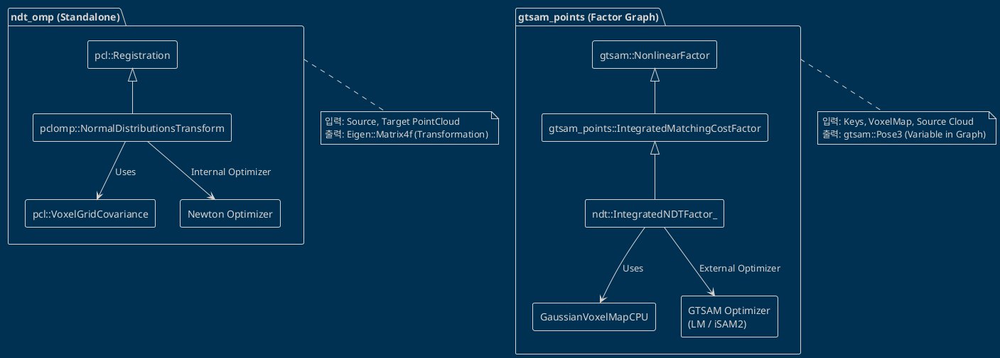

# gtsam_points NDT vs ndt_omp 기술 비교 분석

본 문서는 `gtsam_points` 라이브러리의 NDT(Normal Distributions Transform) 구현체와 Kenji Koide의 널리 알려진 오픈소스 라이브러리인 `ndt_omp`를 심층 비교 분석한다. 두 라이브러리는 동일한 저자에 의해 개발되었으며 핵심 알고리즘 기초를 공유하지만, 설계 목적과 프레임워크 통합 방식에서 뚜렷한 차이를 보인다.

## 목차
1. [개요](#개요)
2. [ndt_omp 라이브러리 개요](#ndt_omp-라이브러리-개요)
3. [아키텍처 비교](#아키텍처-비교)
4. [검색 모드 비교 (NDTSearchMode)](#검색-모드-비교-ndtsearchmode)
5. [스코어 함수 비교](#스코어-함수-비교)
6. [가우시안 파라미터 (d1, d2) 계산](#가우시안-파라미터-d1-d2-계산)
7. [공분산 처리 비교](#공분산-처리-비교)
8. [야코비안/헤시안 계산 비교](#야코비안헤시안-계산-비교)
9. [병렬 처리 비교](#병렬-처리-비교)
10. [사용 패턴 비교](#사용-패턴-비교)
11. [장단점 비교 표](#장단점-비교-표)
12. [결론](#결론)

---

## 개요
`gtsam_points` 라이브러리에 포함된 NDT 구현은 `gtsam` 팩터 그래프 프레임워크와의 긴밀한 통합을 목표로 설계되었다. 반면 `ndt_omp`는 PCL(Point Cloud Library) 환경에서 독립적인 Registration 파이프라인으로 동작하도록 설계되었다. 본 문서는 두 구현체가 Magnusson 2009의 NDT 수식을 어떻게 공유하고 있으며, 아키텍처적으로 어떤 최적화와 수치적 안정성 확보 방안을 적용했는지 비교한다.

## ndt_omp 라이브러리 개요
* **저자**: Kenji Koide (`gtsam_points`와 동일)
* **저장소**: [https://github.com/koide3/ndt_omp](https://github.com/koide3/ndt_omp)
* **목적**: PCL의 표준 NDT registration 알고리즘을 OpenMP를 사용하여 멀티 스레드로 가속화
* **주요 특징**:
    * OpenMP 기반의 병렬화 처리
    * DIRECT1, DIRECT7, DIRECT27 검색 모드 제공
    * PCL(Point Cloud Library) 프레임워크 기반
    * 독립적인 Registration 파이프라인 (팩터 그래프 기반이 아님)

## 아키텍처 비교

### ndt_omp: PCL 기반 독립형 Registration
`ndt_omp`는 PCL의 `pcl::Registration<PointSource, PointTarget>` 클래스를 상속받아 구현되었다. 이는 기존 PCL 사용자들이 익숙한 인터페이스를 제공하며, 입력 포인트 클라우드를 받아 최종 변환 행렬(Eigen::Matrix4f)을 출력하는 블랙박스 형태로 동작한다. 내부적으로는 `pcl::VoxelGridCovariance`를 사용하여 복셀화를 수행하며, Newton's method 최적화기를 내장하고 있다.

### gtsam_points NDT: GTSAM 팩터 그래프 통합
`gtsam_points`의 NDT는 `IntegratedMatchingCostFactor`를 거쳐 `gtsam::NonlinearFactor`를 상속받는다. 이는 NDT 매칭 비용을 팩터 그래프의 에너지 항으로 정의함을 의미한다. 최적화는 `gtsam`의 LM(Levenberg-Marquardt)이나 iSAM2에 의해 수행되며, 증분 업데이트가 가능하다. 커스텀 증분 복셀맵인 `GaussianVoxelMapCPU`를 사용하여 효율적인 타겟 관리를 수행한다.



## 검색 모드 비교 (NDTSearchMode)
두 라이브러리는 사실상 동일한 `NDTSearchMode` 열거형과 검색 로직을 공유한다. 이는 동일 저자가 개발하며 검증된 방식을 그대로 계승했기 때문이다.

| 검색 모드 | 설명 | 후보 개수 | 특징 |
| :--- | :--- | :---: | :--- |
| **DIRECT1** | 현재 포인트가 속한 복셀만 고려 | 1 | 가장 빠르지만 수렴 반경이 좁음 |
| **DIRECT7** | 현재 복셀 + 면을 접하는 6개 인접 복셀 | 7 | 속도와 수렴 성능의 균형 |
| **DIRECT27** | 현재 복셀 + 26개 인접 복셀 (3x3x3 큐브) | 27 | 가장 넓은 수렴 반경, 계산량 높음 |

두 구현체 모두 최소 마할라노비스 거리(Minimum Mahalanobis Distance)를 기준으로 최적의 복셀을 선택하는 로직을 사용한다.

## 스코어 함수 및 비용 재구성 비교
두 라이브러리 모두 Magnusson 2009에서 제안된 지수형(Exponential) NDT 모델을 사용하지만, 최적화 프레임워크와의 호환성을 위해 비용 함수의 형태를 다르게 가져갑니다.

* **ndt_omp 수식**:
  `score += -gauss_d1_ * exp(-gauss_d2_ * e_x_cov_x / 2.0)`
* **gtsam_points NDT 수식 (비음수 비용 재구성)**:
  `error = -gauss_d1 * (1.0 - exp(-gauss_d2 * mahalanobis_dist / 2.0))`

**비음수 비용 재구성(Non-negative Cost Reformulation)**:
`gtsam_points`의 NDT는 기존 `ndt_omp`나 Magnusson의 수식을 그대로 사용할 경우 발생하는 음수 에러 문제를 해결하기 위해 $1 - \exp(\cdot)$ 형태를 사용합니다. 이는 다음 두 가지 이점을 제공합니다:
1. **GTSAM 최적화기 호환성**: GTSAM의 LM 옵티마이저는 에러가 0보다 큰 것으로 가정하고 작동합니다. 음수 에러가 발생하면 에러 감소 여부를 판단하는 데 오류가 생겨 1번의 iteration 만에 조기 수렴(Early Convergence)하는 문제가 발생하는데, 이를 원천적으로 방지합니다.
2. **동일한 미분값**: 에러 함수에 상수를 더하거나 빼는 것은 야코비안과 헤시안에 영향을 주지 않으므로, 최적화 경로의 정확성을 유지하면서 수치적 안정성만 확보할 수 있습니다.

또한, `gtsam_points` NDT는 다음과 같은 수치적 보호 장치(Safeguards)를 적용합니다:

1. **Underflow 방지**: 지수 항(exponent)이 -700 미만일 경우 즉시 0을 반환하여 언더플로우 발생을 차단한다.
2. **범위 검사**: 계산된 지수 값이 1.0보다 크거나 0.0보다 작을 경우 수치적 오류로 간주하고 0을 반환한다.
3. **NaN 체크**: `std::isnan`을 사용하여 최종 결과값의 유효성을 검증한다.
4. **Hessian 안정성**: 위 단계들을 통해 헤시안(Hessian) 행렬에 NaN이나 Inf가 유입되는 것을 원천 차단하여 최적화기(LM/iSAM2)의 붕괴를 막는다.

## 가우시안 파라미터 (d1, d2) 계산
두 라이브러리 모두 Magnusson 2009 공식에 따라 outlier_ratio를 기반으로 d1, d2 파라미터를 계산한다.

```cpp
// 공유되는 계산 로직
c1 = 10.0 * (1.0 - outlier_ratio);
c2 = outlier_ratio / (resolution * resolution * resolution);
d3 = -log(c2);
d1 = -log(c1 + c2) - d3;
d2 = -2.0 * log((-log(c1 * exp(-0.5) + c2) - d3) / d1);
```

기본값 설정에서 약간의 차이가 있다:
* `ndt_omp`: 다양한 기본값을 제공하거나 사용자가 설정 가능.
* `gtsam_points`: 기본 outlier_ratio로 **0.55**를 사용하여 강건한(Robust) 매칭을 유도한다.

## 공분산 처리 비교

| 특성 | ndt_omp | gtsam_points NDT |
| :--- | :--- | :--- |
| **복셀 엔진** | `pcl::VoxelGridCovariance` | `GaussianVoxelMapCPU` (Custom) |
| **업데이트 방식** | 그리드 생성 시 일괄 계산 (Batch) | 증분 추가 및 파이널라이즈 (Incremental) |
| **정규화 방법** | `min_points_per_voxel` 임계값 사용 | 고유값 분해(Eigendecomposition) 기반 정규화 |
| **정규화 수식** | - | λᵢ = max(λᵢ, ε · λ_max) |
| **인버터 연산** | 필요 시마다 계산 | 지연 계산(Lazy compute) 및 캐싱 |

`gtsam_points`는 복셀 공분산 행렬의 정규화를 위해 최대 고유값 대비 최소 고유값의 비율을 강제하는 방식을 사용하여, 평면이나 선형 클라우드에서도 수치적으로 안정적인 역행렬 계산이 가능하도록 설계되었다.

## 야코비안/헤시안 계산 비교

### ndt_omp의 계산 방식
`ndt_omp`는 스코어 함수의 1차 미분(Jacobian)과 2차 미분(Hessian)을 명시적으로 계산한다. 최적화 매개변수화(Parameterization)를 위해 오일러 각(Euler angles)과 평행 이동(Translation)을 사용하며, Newton's method를 위한 `computeDerivatives`, `computeHessian` 함수를 호출한다.

### gtsam_points의 계산 방식
`gtsam_points`는 리 대수(Lie Algebra, se(3)) 기반의 매개변수화를 사용한다.
* `SO3::Hat` 연산자를 사용한 기하학적 야코비안 유도.
* `derivative_scale`을 통한 수치적 스케일 조절.
* 계산된 성분들을 `H_target`, `H_source`, `b_target` 등에 누적하여 GTSAM의 `HessianFactor`를 생성한다.
* 결과적으로 GTSAM의 전역 그래프 최적화 구조에 직접 편입된다.

## 병렬 처리 비교

두 라이브러리 모두 멀티 코어 CPU를 활용하기 위해 병렬 처리를 지원하지만, 구현 방식에 차이가 있다.

* **ndt_omp**:
    * 전적으로 OpenMP에 의존한다.
    * 소스 포인트 클라우드 루프에 대해 `#pragma omp parallel for`를 적용한다.
    * 스케줄링 방식으로 `schedule(guided, 8)`을 주로 사용하여 부하 불균형을 해소한다.

* **gtsam_points**:
    * **OpenMP**와 **TBB(Threading Building Blocks)**를 모두 지원한다.
    * `scan_matching_reduce_omp/tbb` 패턴을 사용한다.
    * 각 스레드마다 독립적인 로컬 헤시안/그레디언트(H/b)를 축적한 뒤 최종적으로 리듀스(Reduce)하는 방식을 사용하여 데이터 경합(Race condition)을 최소화한다.
    * `ndt_omp`와 동일하게 `schedule(guided, 8)`을 기본 스케줄러로 채택하고 있다.

## 사용 패턴 비교

### ndt_omp 코드 예시 (PCL 스타일)
```cpp
// 라이브러리 초기화 및 파라미터 설정
pclomp::NormalDistributionsTransform<pcl::PointXYZ, pcl::PointXYZ> ndt;
ndt.setResolution(1.0);
ndt.setNeighborhoodSearchMethod(pclomp::DIRECT7);

// 데이터 입력
ndt.setInputTarget(target_cloud);
ndt.setInputSource(source_cloud);

// 정렬 수행 (독립적인 최적화 루프)
pcl::PointCloud<pcl::PointXYZ> aligned;
ndt.align(aligned, initial_guess);

// 결과 획득
Eigen::Matrix4f result = ndt.getFinalTransformation();
```

### gtsam_points NDT 코드 예시 (팩터 그래프 스타일)
```cpp
#include <ndt/integrated_ndt_factor.hpp>

// 팩터 생성 (타겟 복셀맵과 소스 클라우드 연결)
auto factor = gtsam::make_shared<ndt::IntegratedNDTFactor>(
    target_key, source_key, target_voxelmap, source_cloud
);

// 파라미터 설정
factor->set_search_mode(ndt::NDTSearchMode::DIRECT7);
factor->set_outlier_ratio(0.55);

// 그래프에 추가
gtsam::NonlinearFactorGraph graph;
graph.add(factor);

// GTSAM 최적화기를 통한 처리 (다른 센서 데이터와 융합 가능)
gtsam::LevenbergMarquardtOptimizer optimizer(graph, initial_values);
gtsam::Values results = optimizer.optimize();
```

## 장단점 비교 표

| 특성 | ndt_omp | gtsam_points NDT |
| :--- | :--- | :--- |
| **기반 프레임워크** | PCL (Standalone) | GTSAM (Factor Graph) |
| **최적화 시나리오** | 2-프레임 Pairwise 매칭 | 다중 프레임 그래프 최적화 |
| **내장 최적화기** | Newton's Method | LM, iSAM2, Dogleg 등 (GTSAM 제공) |
| **공분산 활용** | 타겟 복셀의 공분산만 사용 | 타겟 복셀의 공분산만 사용 (동일) |
| **증분 처리 지원** | 미지원 (매번 새로 계산) | iSAM2를 통한 효율적인 증분 업데이트 |
| **GPU 가속 가능성** | 낮음 (CPU 전용 설계) | 높음 (CUDA Factor 패턴 적용 가능) |
| **수치적 안정성** | 일반적인 PCL 수준 | 4단계 보호 장치 및 정규화 강화 |
| **병렬화 라이브러리** | OpenMP 전용 | OpenMP + TBB 지원 |

## 결론
`gtsam_points`의 NDT 구현은 `ndt_omp`의 검증된 수학적 모델(Magnusson 2009, DIRECT 검색 모드)을 계승하면서도, **팩터 그래프 기반의 SLAM 시스템**에 최적화되도록 완전히 재설계되었다. 최근의 버그 수정 및 비용 재구성을 통해 NDT는 평균 회전 오차 **0.510°**, 평균 평행이동 오차 **0.078m**라는 우수한 성능을 입증하며 다른 정합 알고리즘들과 대등한 경쟁력을 확보하였다.

가장 큰 차별점은 `ndt_omp`가 단발성 정렬(Registration)에 집중하는 반면, `gtsam_points` NDT는 전역 그래프의 에너지 항으로서 동작하며 iSAM2와 같은 최신 최적화 알고리즘과 유기적으로 결합될 수 있다는 점이다. 또한, 수치적 예외 처리를 대폭 강화하여 장시간 주행 시 발생할 수 있는 최적화기의 수치적 붕괴 문제를 효과적으로 방지하고 있다.

결론적으로, 단순한 두 클라우드 사이의 정렬이 목적이라면 `ndt_omp`가 간편한 대안이 될 수 있으나, 높은 정확도와 수렴 안정성이 요구되는 정교한 SLAM 프레임워크를 구축하고자 한다면 `gtsam_points` NDT가 최적의 솔루션을 제공한다.

생성일: 2026-02-19
