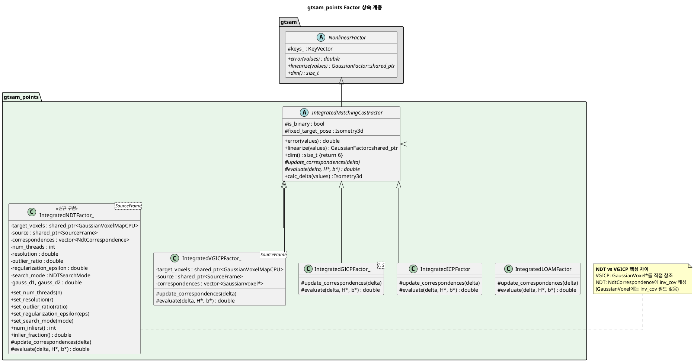
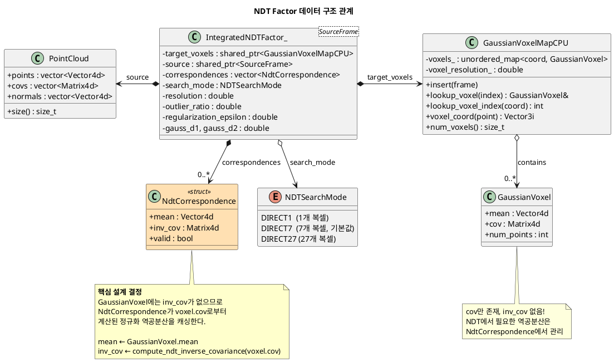
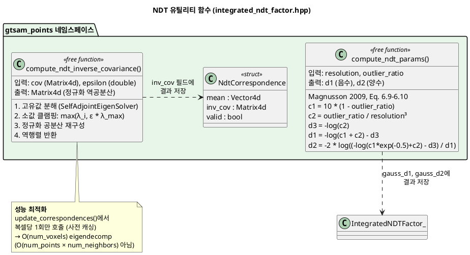
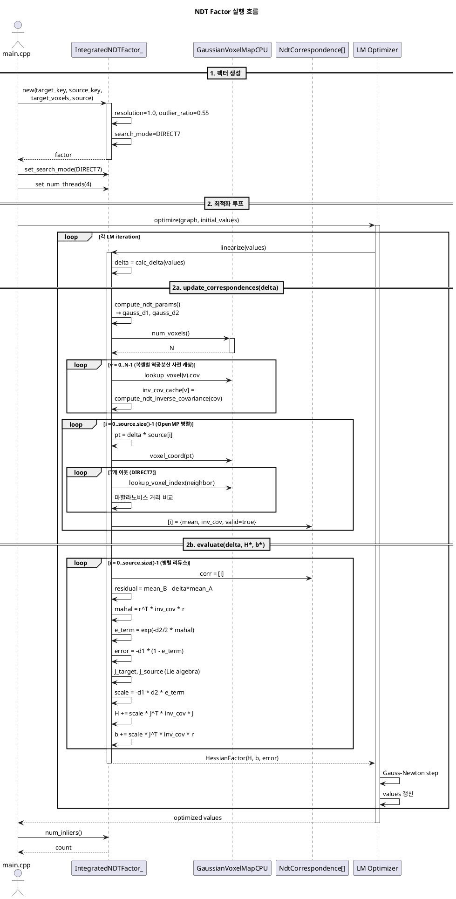
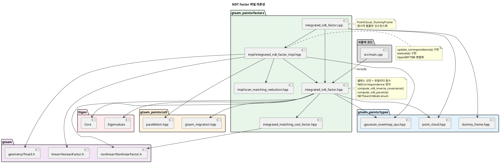
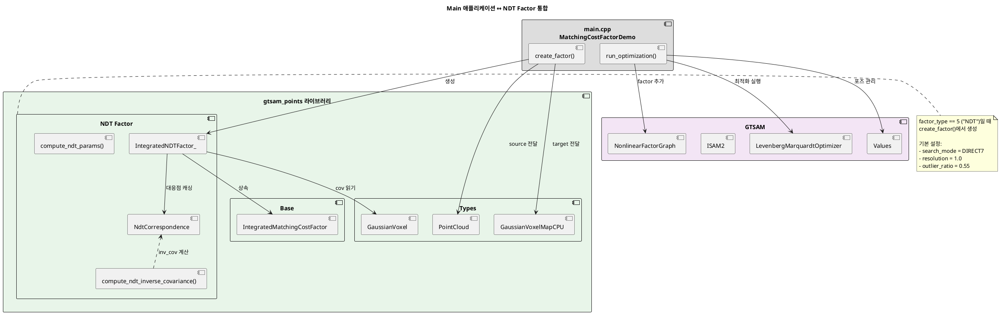

# NDT Factor UML 다이어그램

**작성일**: 2026-02-19  
**대상**: `gtsam_points` 라이브러리에 통합된 NDT Factor 구현 (NdtCorrespondence 기반)

> **참고**: 모든 다이어그램은 [PlantUML](https://www.plantuml.com/plantuml/uml/)에 붙여넣어 렌더링할 수 있다.

---

## 1. 클래스 상속 계층도

NDT Factor는 GICP/VGICP와 동일한 추상 기반 클래스 `IntegratedMatchingCostFactor`를 상속한다.



---

## 2. NDT Factor 데이터 구조 관계도



---

## 3. 유틸리티 함수 관계도



---

## 4. 실행 시퀀스 다이어그램



---

## 5. 패키지/파일 의존성 다이어그램



---

## 6. 컴포넌트 다이어그램 — Main과의 통합



---

## 다이어그램 렌더링 방법

### 온라인
- https://www.plantuml.com/plantuml/uml/ 에 코드 블록 내용을 붙여넣기

### VS Code
```bash
code --install-extension jebbs.plantuml
# Alt+D 로 미리보기
```

### CLI
```bash
java -jar plantuml.jar -tsvg uml.md
```

---

**최종 수정일**: 2026-02-19  
**관련 문서**: [README.md](./README.md)
