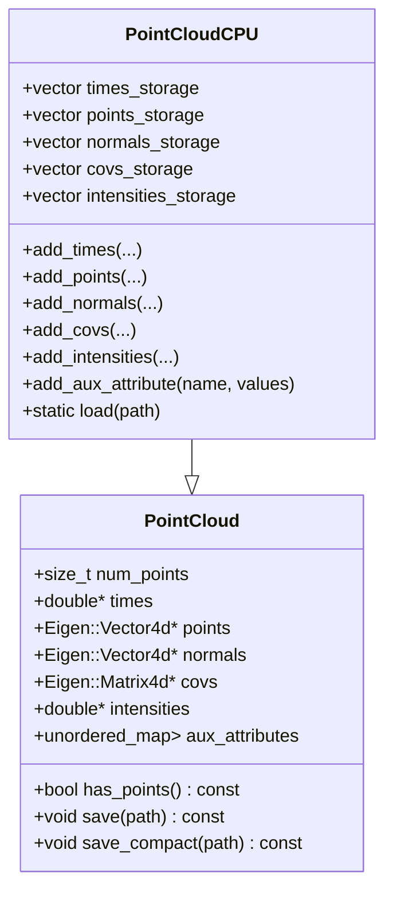

# gtsam_points 라이브러리 구조/사용법 (C++ 중심)

이 문서는 **gtsam_points**(GTSAM 기반 포인트클라우드 SLAM용 팩터/옵티마이저 모음)의 **라이브러리 구조를 Mermaid 다이어그램으로 정리**하고, **외부 C++ 프로젝트에서의 사용법(CMake/코드 예시)**까지 포함해 설명합니다.

> 기준: 이 저장소의 `include/gtsam_points/**`, `src/gtsam_points/**`, `CMakeLists.txt`를 기반으로 작성.

---

## 1) 전체 개요

gtsam_points는 다음을 제공합니다.

- **PointCloud 데이터 구조 (CPU/GPU)** 및 속성(times/normals/covs/intensities/aux)
- **Nearest Neighbor Search(ANN)**: KdTree, iVox(IncrementalVoxelMap), IncrementalCovarianceVoxelMap, FastOccupancyGrid 등
- **Features**: normal/covariance/FPFH 추정
- **Registration & Global Registration**: alignment, RANSAC, Graduated Non-Convexity
- **Segmentation**: region growing, min-cut
- **GTSAM Factor**: ICP/GICP/VGICP/LOAM/Colored/CT-ICP/Bundle Adjustment/IMU 등
- **Optimizer Extensions**: LevenbergMarquardtOptimizerExt, ISAM2Ext, IncrementalFixedLagSmootherExt 등 (GPU 팩터 포함)

빌드 결과물(CMake 타깃):

- `gtsam_points::gtsam_points` (항상)
- `gtsam_points::gtsam_points_cuda` (옵션, `-DBUILD_WITH_CUDA=ON`)

---

## 2) 디렉터리/모듈 구조

### 2.1 최상위 구조

```mermaid
flowchart TB
  repo[gtsam_points repo]

  repo --> CMake[CMakeLists.txt\n(build + install + export)]
  repo --> inc[include/gtsam_points\n(public headers)]
  repo --> src[src/gtsam_points\n(implementations)]
  repo --> ex[src/example\n(C++ examples)]
  repo --> demo[src/demo\n(visual demos; iridescence 필요)]
  repo --> test[src/test\n(GTest; 옵션)]
  repo --> third[thirdparty/nanoflann\n(header-only)]
  repo --> cmake[cmake/*.cmake.in\n(package config templates)]
  repo --> docs[docs/\n(doxygen, index)]
  repo --> data[data/\n(sample datasets)]

  CMake --> lib[gtsam_points (shared)]
  CMake --> libc[gtsam_points_cuda (shared, optional)]
  lib --> inc
  lib --> src
  libc --> inc
  libc --> src
```

### 2.2 public API(헤더) 기준 모듈

`include/gtsam_points/` 하위 디렉터리가 사실상 public API의 모듈 경계입니다.

```mermaid
flowchart LR
  subgraph API[include/gtsam_points]
    util[util/\nI/O, math, trajectory, profiling]
    types[types/\nPointCloud, Voxelmap, Frame traits]
    ann[ann/\nNearest neighbor search]
    features[features/\nNormal/Cov/FPFH]
    factors[factors/\nGTSAM factors (scan matching, BA, CT, IMU, ...)]
    optimizers[optimizers/\nLM/ISAM2/FLS extensions]
    registration[registration/\nRANSAC/GNC/etc]
    segmentation[segmentation/\nRegionGrowing/MinCut]
    cuda[cuda/\nCUDA utilities + GPU factor plumbing]
  end

  factors --> types
  factors --> ann
  factors --> util
  factors --> cuda
  optimizers --> factors
  features --> types
  features --> ann
  registration --> features
  registration --> ann
  segmentation --> ann
  types --> util
```

> 구현은 `src/gtsam_points/<module>/*.cpp` (및 CUDA의 경우 `*.cu`, `*_gpu.cpp`)에 대응합니다.

---

## 3) CMake 타깃/링킹 구조

### 3.1 내부 빌드 타깃

```mermaid
flowchart TB
  subgraph Targets[CMake Targets]
    T1[gtsam_points::gtsam_points\n(shared)]
    T2[gtsam_points::gtsam_points_cuda\n(shared, optional)]
  end

  subgraph Deps[Core Dependencies]
    GTSAM[gtsam]
    GTSAMU[gtsam_unstable]
    Eigen[Eigen3::Eigen]
    Boost[Boost::graph + Boost::filesystem]
    OMP[OpenMP::OpenMP_CXX (optional)]
    TBB[TBB::tbb (optional)]
    CUDA[CUDA::cudart (optional)]
  end

  T1 --> GTSAM
  T1 --> GTSAMU
  T1 --> Eigen
  T1 --> Boost
  T1 --> OMP
  T1 --> TBB

  T2 --> CUDA
  T2 --> GTSAM
  T2 --> GTSAMU
  T2 --> Eigen
  T2 --> TBB
  T2 --> OMP

  T1 -."BUILD_WITH_CUDA=ON일 때".-> T2
```

### 3.2 외부 프로젝트에서 find_package 사용

설치 후에는 다음처럼 사용합니다.

```cmake
find_package(gtsam_points REQUIRED)

add_executable(my_app main.cpp)
target_link_libraries(my_app PRIVATE gtsam_points::gtsam_points)
```

`gtsam_points-config.cmake`에서 의존성(Eigen3/GTSAM/GTSAM_UNSTABLE/OpenMP/Boost/TBB/CUDA)을 `find_dependency()`로 가져오므로, 외부 프로젝트는 보통 `gtsam_points::gtsam_points`만 링크하면 됩니다.

> CUDA를 켠 빌드/설치를 사용 중이라면, `gtsam_points::gtsam_points`가 내부적으로 `gtsam_points_cuda`를 링크하도록 구성되어 있습니다.

### 3.3 소스 트리로 포함(add_subdirectory)해서 사용

```cmake
add_subdirectory(path/to/gtsam_points)

add_executable(my_app main.cpp)
target_link_libraries(my_app PRIVATE gtsam_points)
```

> 이 방식은 설치 없이 빠르게 붙일 때 유용하지만, CI/배포/버전 관리 측면에서는 `find_package` 방식이 더 일반적입니다.

---

## 4) 핵심 타입 구조 (PointCloud 계열)

`PointCloud`는 “속성 포인터만 들고 있는 최소 프레임”이고, `PointCloudCPU`는 이를 상속해 실제 스토리지(벡터)를 소유합니다.



실무적으로는:

- **내가 메모리를 직접 관리하고 싶다** → `PointCloud`에 raw pointer를 직접 꽂아서 사용(소유권은 사용자)
- **간단히 쓰고 싶다** → `PointCloudCPU`를 써서 스토리지를 맡긴다

---

## 5) 모듈별 설명 (무엇이 어디에 있고, 언제 쓰는가)

### 5.1 util/

대표 헤더:

- `gtsam_points/util/read_points.hpp` : KITTI `.bin` 같은 포인트 파일 로딩 유틸
- `gtsam_points/util/continuous_trajectory.hpp`, `bspline.hpp` : 연속시간 궤적(개발중 포함)
- `gtsam_points/util/parallelism.hpp`, `sort_omp.hpp` : 병렬 처리 유틸

일반적인 흐름:

1) `read_points()`/`read_points4()`로 raw points 읽기
2) `PointCloudCPU`로 프레임 생성
3) 필요 시 다운샘플링/정렬/변환

### 5.2 types/

- `types/point_cloud.hpp` : 포인터 기반 최소 프레임
- `types/point_cloud_cpu.hpp` : CPU 스토리지 소유 프레임 (+ 샘플링/변환/머지 유틸)
- `types/point_cloud_gpu.hpp` : GPU 오프로딩 관련 타입(빌드 옵션에 따라)
- `types/gaussian_voxelmap*.hpp` : voxelmap 데이터 구조
- `types/frame_traits.hpp` : 템플릿 기반 “Frame” 어댑터(traits)로 사용자 커스텀 프레임도 연결 가능

### 5.3 ann/

NN Search / 맵 자료구조:

- `KdTree`, `KdTreeEx`, `SmallKdTree` 등
- `IncrementalVoxelMap` 및 `iVox` alias (`ann/ivox.hpp`)
- `IncrementalCovarianceVoxelMap` : online covariance/normal 관련
- `FastOccupancyGrid` : overlap estimation 등에 유용

`IntegratedGICPFactor_<Target, Source>`처럼 **팩터 템플릿이 Target을 NN search 구조로 받는** 디자인이 많아, ANN 타입은 팩터 구성의 핵심 구성요소입니다.

### 5.4 features/

- normal/covariance/FPFH 추정
- 전역 정합(global registration) 파이프라인에서 보조 피처로 사용

### 5.5 factors/

GTSAM `NonlinearFactor`를 기반으로 한 “스캔 매칭/BA/연속시간/IMU” 팩터 모음.

주요 예:

- `IntegratedICPFactor` / `IntegratedPointToPlaneICPFactor`
- `IntegratedGICPFactor`, `IntegratedVGICPFactor` (+ GPU)
- `IntegratedLOAMFactor`
- Colored / CT-ICP / Bundle adjustment / IMU

### 5.6 optimizers/

GTSAM의 최적화기를 확장/파생하여, 대형 팩터/ GPU 팩터의 효율적 처리를 지원.

- `LevenbergMarquardtOptimizerExt`
- `ISAM2Ext`
- `IncrementalFixedLagSmootherExt` (+ fallback)

### 5.7 registration/

- `ransac.hpp` : global registration
- `graduated_non_convexity.hpp` : GNC 기반 global registration
- `alignment.hpp` : 정합 결과/정렬 관련 유틸

### 5.8 segmentation/

- `region_growing.hpp`
- `min_cut.hpp`

### 5.9 cuda/

CUDA 유틸(메모리/스트림/그래프 등) + GPU factor 지원.
빌드 옵션 `-DBUILD_WITH_CUDA=ON`일 때 `gtsam_points_cuda` 타깃이 생성됩니다.

---

## 6) “사용 흐름” 구조 (팩터 기반 정합)

### 6.1 프레임-투-프레임 ICP (가장 기본)

다음 다이어그램은 `src/example/basic_scan_matching.cpp`의 흐름을 요약합니다.

```mermaid
sequenceDiagram
  participant IO as util/read_points
  participant PC as types/PointCloudCPU
  participant Graph as gtsam::NonlinearFactorGraph
  participant Factor as IntegratedICPFactor
  participant Opt as LevenbergMarquardtOptimizerExt

  IO->>PC: read_points() -> vector<Eigen::Vector3f>
  PC->>PC: wrap into PointCloudCPU(shared_ptr)
  Graph->>Graph: add PriorFactor (fix target pose)
  Graph->>Factor: construct IntegratedICPFactor(target_key, source_key, target_frame, source_frame)
  Factor->>Graph: graph.add(factor)
  Opt->>Graph: optimize(graph, initial values)
  Opt-->>Opt: iterative linearize/solve
```

#### Minimal C++ 예시 (시각화 의존성 제거 버전)

```cpp
#include <gtsam/nonlinear/NonlinearFactorGraph.h>
#include <gtsam/nonlinear/Values.h>
#include <gtsam/slam/PriorFactor.h>
#include <gtsam/geometry/Pose3.h>

#include <gtsam_points/util/read_points.hpp>
#include <gtsam_points/types/point_cloud_cpu.hpp>
#include <gtsam_points/factors/integrated_icp_factor.hpp>
#include <gtsam_points/optimizers/levenberg_marquardt_ext.hpp>

int main() {
  // 1) load points
  const auto target_points = gtsam_points::read_points("data/kitti_00/000000.bin");
  const auto source_points = gtsam_points::read_points("data/kitti_00/000001.bin");

  // 2) create frames
  auto target = std::make_shared<gtsam_points::PointCloudCPU>(target_points);
  auto source = std::make_shared<gtsam_points::PointCloudCPU>(source_points);

  // 3) initial values
  gtsam::Values values;
  values.insert(0, gtsam::Pose3());
  values.insert(1, gtsam::Pose3());

  // 4) build graph
  gtsam::NonlinearFactorGraph graph;
  graph.emplace_shared<gtsam::PriorFactor<gtsam::Pose3>>(
    0, gtsam::Pose3(), gtsam::noiseModel::Isotropic::Precision(6, 1e6));

  auto icp = gtsam::make_shared<gtsam_points::IntegratedICPFactor>(0, 1, target, source);
  icp->set_max_correspondence_distance(5.0);
  graph.add(icp);

  // 5) optimize
  gtsam_points::LevenbergMarquardtExtParams params;
  params.set_verbose();
  gtsam_points::LevenbergMarquardtOptimizerExt opt(graph, values, params);
  const auto& result = opt.optimize();

  const auto T_source = result.at<gtsam::Pose3>(1);
  std::cout << "Estimated source pose:\n" << T_source.matrix() << std::endl;
  return 0;
}
```

#### 빌드(CMake) 예시

```cmake
cmake_minimum_required(VERSION 3.16)
project(my_app LANGUAGES CXX)
set(CMAKE_CXX_STANDARD 17)

find_package(gtsam_points REQUIRED)

add_executable(my_app main.cpp)
target_link_libraries(my_app PRIVATE gtsam_points::gtsam_points)
```

### 6.2 프레임-투-맵 GICP + iVox (고급)

`src/example/advanced_scan_matching.cpp`는 iVox를 맵으로 유지하며, 새 프레임을 GICP로 정합합니다.

핵심 포인트:

- Target은 `iVox` (IncrementalVoxelMap)처럼 **NN search 가능한 맵 구조**
- Source는 `PointCloudCPU` 프레임
- GICP는 보통 **covariance**가 필요하므로 프레임에 cov를 추가

```cpp
#include <gtsam/nonlinear/NonlinearFactorGraph.h>
#include <gtsam/nonlinear/Values.h>
#include <gtsam/slam/PriorFactor.h>
#include <gtsam/geometry/Pose3.h>

#include <gtsam_points/util/read_points.hpp>
#include <gtsam_points/types/point_cloud_cpu.hpp>
#include <gtsam_points/ann/ivox.hpp>
#include <gtsam_points/features/covariance_estimation.hpp>
#include <gtsam_points/factors/integrated_gicp_factor.hpp>
#include <gtsam_points/optimizers/levenberg_marquardt_ext.hpp>

int main(int argc, char** argv) {
  if (argc < 2) {
    std::cerr << "usage: my_app /path/to/kitti/00/velodyne" << std::endl;
    return 1;
  }
  const std::string seq = argv[1];

  const double voxel_resolution = 1.0;
  const int num_threads = 4;
  std::mt19937 mt;

  auto map = std::make_shared<gtsam_points::iVox>(voxel_resolution);
  gtsam::Pose3 T_world_lidar;

  for (int i = 0;; i++) {
    const std::string bin = (boost::format("%s/%06d.bin") % seq % i).str();
    auto pts = gtsam_points::read_points4(bin);
    if (pts.empty()) break;
    for (auto& p : pts) p.w() = 1.0f;

    auto frame = std::make_shared<gtsam_points::PointCloudCPU>(pts);
    frame->add_covs(gtsam_points::estimate_covariances(frame->points, frame->size(), 10, num_threads));

    if (i != 0) {
      gtsam::Values init;
      init.insert(0, gtsam::Pose3());
      init.insert(1, T_world_lidar);

      gtsam::NonlinearFactorGraph graph;
      graph.emplace_shared<gtsam::PriorFactor<gtsam::Pose3>>(
        0, gtsam::Pose3(), gtsam::noiseModel::Isotropic::Precision(6, 1e6));

      // Target=map(iVox), Source=frame(PointCloud)
      using FactorT = gtsam_points::IntegratedGICPFactor_<gtsam_points::iVox, gtsam_points::PointCloud>;
      auto gicp = gtsam::make_shared<FactorT>(0, 1, map, frame, map);
      gicp->set_num_threads(num_threads);
      graph.add(gicp);

      gtsam_points::LevenbergMarquardtExtParams params;
      params.setMaxIterations(20);
      gtsam_points::LevenbergMarquardtOptimizerExt opt(graph, init, params);
      const auto& result = opt.optimize();
      T_world_lidar = result.at<gtsam::Pose3>(1);
    }

    // integrate into map (in world frame if you transformed the frame)
    map->insert(*frame);
  }
  return 0;
}
```

---

## 7) “어떤 헤더를 include 해야 하는가?” 체크리스트

목적별로 자주 쓰는 include 조합:

- 파일 로딩 + CPU 프레임
  - `#include <gtsam_points/util/read_points.hpp>`
  - `#include <gtsam_points/types/point_cloud_cpu.hpp>`
- ICP/GICP/VGICP 등의 팩터
  - `#include <gtsam_points/factors/integrated_icp_factor.hpp>`
  - `#include <gtsam_points/factors/integrated_gicp_factor.hpp>`
  - `#include <gtsam_points/factors/integrated_vgicp_factor.hpp>`
- 확장 LM 최적화기
  - `#include <gtsam_points/optimizers/levenberg_marquardt_ext.hpp>`
- iVox 맵
  - `#include <gtsam_points/ann/ivox.hpp>`
- covariance 추정(예: GICP에 필요)
  - `#include <gtsam_points/features/covariance_estimation.hpp>`

---

## 8) 빌드 옵션 요약

`CMakeLists.txt`에서 제공하는 주요 옵션:

- `BUILD_TESTS` / `BUILD_TESTS_PCL`
- `BUILD_DEMO` / `BUILD_EXAMPLE` / `BUILD_TOOLS`
- `BUILD_WITH_OPENMP` (기본 ON)
- `BUILD_WITH_TBB`
- `BUILD_WITH_CUDA` / `BUILD_WITH_CUDA_MULTIARCH`

CUDA를 켤 때는 Eigen 버전 제약(3.3.90 이상 권장)이 경고로 안내됩니다.

---

## 9) Troubleshooting (자주 겪는 문제)

1. **GTSAM 버전 문제**
   - 저장소 README 기준으로는 **GTSAM 4.3a0**를 안내하고, CMake는 `find_package(GTSAM 4.2 REQUIRED)`도 보입니다. 실제 환경에선 설치된 GTSAM 버전/패키지 구성에 맞춰야 합니다.
   - 증상: `find_package(GTSAM ...)` 실패, ABI mismatch

2. **CUDA + Eigen 호환**
   - Eigen이 너무 낮으면 CUDA 빌드 시 경고/빌드 실패 가능.

3. **Demo/Example 빌드 의존성**
   - Demo/Example은 시각화용 `iridescence`/`glk`/`guik` 등이 필요할 수 있습니다.
   - 라이브러리 자체를 쓰는 외부 프로젝트는 보통 해당 의존성이 필요 없습니다.

---

## 10) 문서 유지/확장 가이드

- 새로운 모듈이 추가되면: `2) 디렉터리/모듈 구조` 다이어그램에 노드 추가
- 새로운 public header가 추가되면: `7) include 체크리스트` 업데이트
- 새로운 타깃/옵션이 추가되면: `3) CMake 타깃/링킹 구조`, `8) 빌드 옵션` 업데이트
